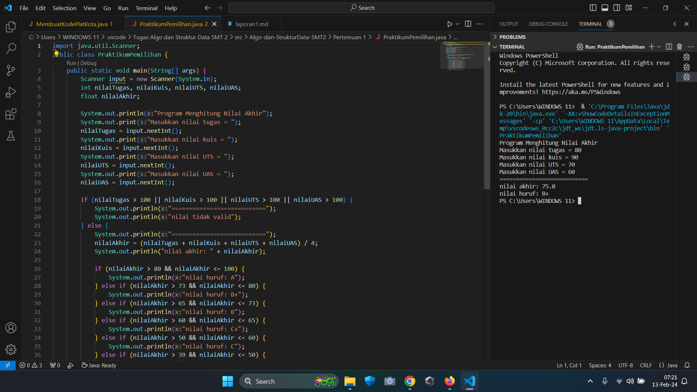
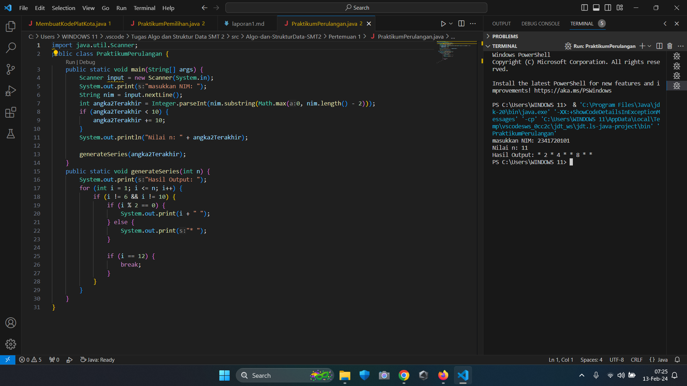
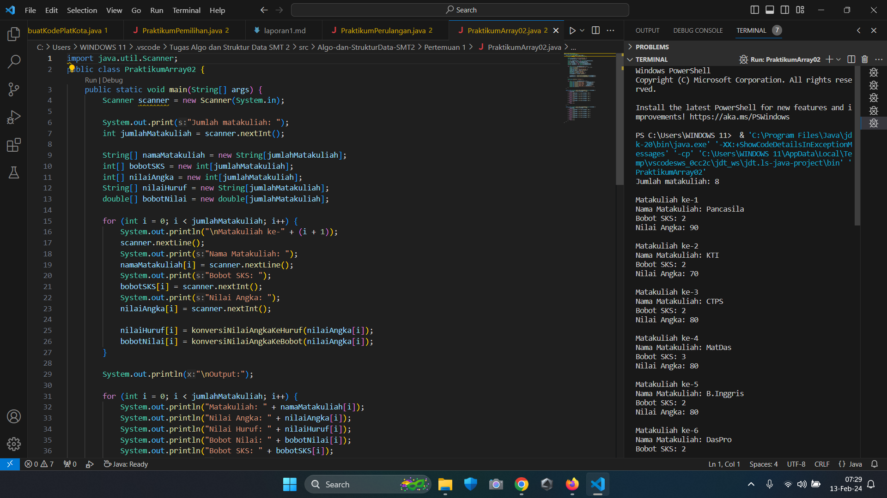
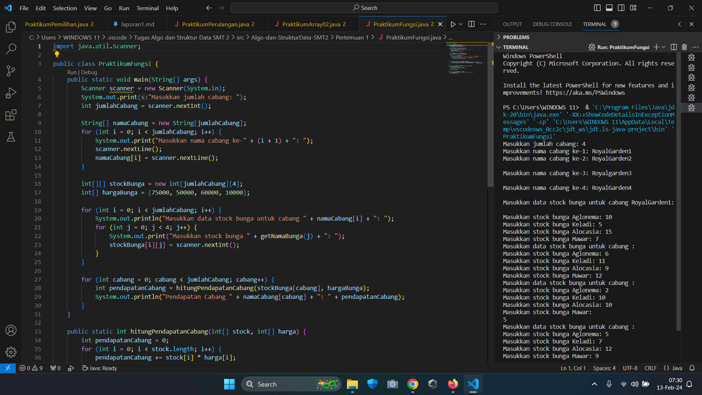
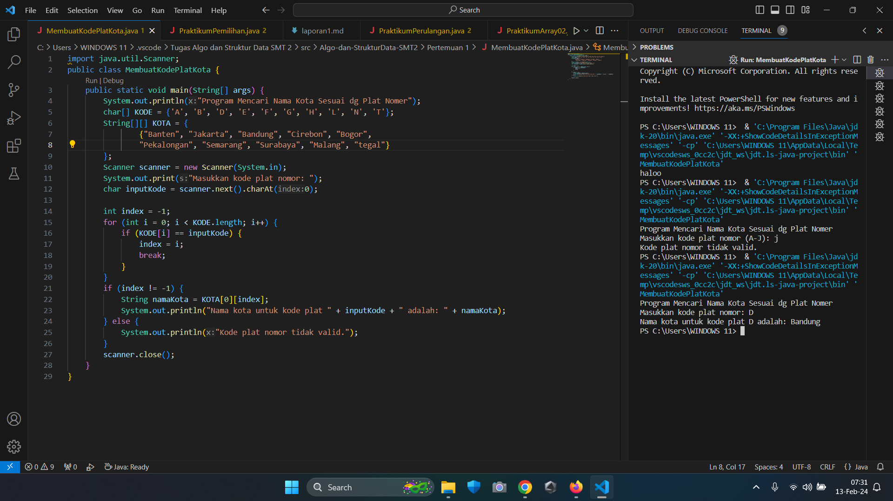
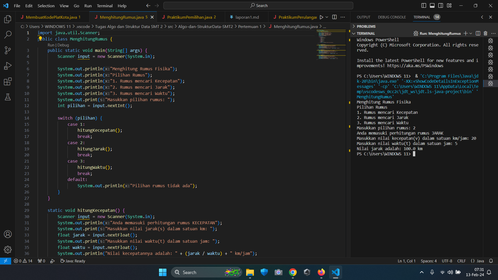

# Laporan Praktikum Pertemuan 1
nama: Achmad Maulana Hamzah, 
prodi: D4TI, kelas: 1H, absen: 02

## Tujuan Praktikum
Setelah melakukan materi praktikum ini, mahasiswa mampu:
1. Mengimplementasikan pemilihan, perulangan, array, dan fungsi dalam kode program Java

## Praktikum
1. Pemilihan

Buatlah program untuk menghitung nilai akhir dari mahasiswa dengan ketentuan 20% nilai tugas, 20% dari nilai kuis, 30% nilai UTS, dan 40% nilai UAS. Setiap nilai yang dimasukkan mempunyai batas nilai 0 ‐ 100. Ketika pengguna memasukkan diluar rentang tersebut maka akan keluar output “nilai tidak valid”. Ketika nilai akhir sudah didapatkan selanjutnya lakukan konversi nilai dengan ketentuan sebagai berikut:

Jika Nilai Huruf yang didapatkan adalah A,B+,B+C+,C maka LULUS, jika nilai huruf D dan E
maka TIDAK LULUS.

• Input dari program berupa komponen nilai tugas,kuis, UTS, UAS

• Otuput dari program “nilai tidak valid” jika nilai yang dimasukkan diluar ketentuan

• Output dari program berupa hasil nilai akhir, nilai huruf, dan keterangan
LULUS/TIDAK LULUS

Kode Program:

2. Perulangan

Buatlah program yang dapat menampilkan deretan bilangan dari angka 1 sampai n kecuali angka 6 dan 10, angka ganjil dicetak dengan asterik “*”, angka genap dicetak sesuai bilangan aslinya, dengan n = 2 digit terakhir NIM anda.
*bila n<10 maka tambahkan 10 (n+=10)

Contoh:
Input NIM: 2341720102 maka n=12
OUTPUT : * 2 * 4 * * 8 * * 12

Contoh 2:
Input NIM: 2341720113 maka n=13
OUTPUT : * 2 * 4 * * 8 * * 12

Kode Program:

3. Array

Buatlah program untuk menghitung IP Semester dari matakuliah yang Anda tempuh semester lalu. Formula untuk menghitung IP semester sebagai berikut :

𝐼𝑃 𝑆𝑒𝑚𝑒𝑠𝑡𝑒𝑟 = ∑ (𝑁𝑖𝑙𝑎𝑖 𝑆𝑒𝑡𝑎𝑟𝑎𝑖 ∗ 𝑏𝑜𝑏𝑜𝑡 𝑆𝐾𝑆𝑖) / ∑ 𝑆𝐾𝑆

Nilai setara didapatkan dari tabel konversi berikut ini :

Input dari program berupa nama matakuliah, bobot SKS, serta nilai huruf dari matakuliah tersebut.

Kode Program:

4. Fungsi

RoyalGarden adalah toko bunga yang memiliki banyak cabang. Setiap hari Stock Bunga dan bunga- bunga yang dijual selalu dicatat dengan rincian seperti berikut ini:

Baris = Cabang Toko, Kolom = Stock bunga pada hari x

Rincian Harga Aglonema =75.000 , Keladi = 50.000, Alocasia =60.000, Mawar =10.000.
1. Buatlah fungsi untuk menampilkan pendapatan setiap cabang jika semua bunga habis
terjual.
2. Buatlah fungsi untuk mengetahui jumlah Stock setiap jenis bunga pada cabang royalgarden4. Jika terdapat informasi tambahan berupa pengurangan stock karena bunga tersebut mati. Dengan rincian Aglonema -1, Keladi -2, Alocasia -0, Mawar -5.

Kode Program:

## Tugas

1. Susun program untuk membuat dua buah array berikut isinya sebagai berikut. Array pertama adalah array satu dimensi char KODE[10], berisi kode plat mobil. Array kedua, array dua dimensi char KOTA[10][12] berisi nama kota yang berpasangan dengan kode plat mobil. Ketika pengguna memberikan input kode plat nomor maka program akan mengeluarkan nama kota dari kode plat nomor tersebut.

Kode Program:

2. Buat program untuk menghitung rumus kecepatan, jarak, dan waktu Berikut adalah persamaan untuk menghitung rumus tersebut :

Rumus Kecepatan
𝑣 = 𝑠/𝑡

Rumus Jarak
𝑠 = 𝑣. 𝑡

Rumus Waktu
𝑡 = 𝑠/𝑣

Keterangan :
𝑣 = 𝑘𝑒𝑐𝑒𝑝𝑎𝑡𝑎𝑛
𝑠 = 𝑗𝑎𝑟𝑎𝑘
𝑡 = 𝑤𝑎𝑘𝑡𝑢

Program yang dibuat memiliki fungsi sebagai berikut:

a. Menu (Untuk memilih rumus yang akan dihitung (kecepatan/jarak/waktu)

b. Menghitung hasil perhitungan Kecepatan

c. Menghitung hasil perhitungan Jarak

d. Menghitung hasil perhitungan Waktu

Panggil fungsi-fungsi tersebut pada fungsi main!

Kode Program:

