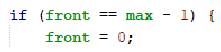

# Jobsheet 9 (QUEUE)
Nama: Achmad Maulana Hamzah

Kelas / Absen: TI 1H / 02

NIM: 2341720172
## 1.1 Tujuan Praktikum
Setelah melakukan materi praktikum ini, mahasiswa mampu:
1. Mengenal struktur data Queue
2. Membuat dan mendeklarasikan struktur data Queue
3. Menerapkan algoritma Queue dengan menggunakan array

## 1.2 Praktikum 1
### 1.2.1 Verifikasi Hasil Praktikum

### 1.2.2 Pertanyaan
1. Pada konstruktor, mengapa nilai awal atribut front dan rear bernilai -1, sementara atribut size
bernilai 0?

Jawaban:

Pada konstruktor, atribut front dan rear diatur nilainya menjadi -1 untuk menandakan bahwa antrian (queue) pada awalnya kosong. Ketika antrian kosong, tidak ada elemen yang berada di depan atau di belakang. Nilai -1 dipilih karena tidak ada indeks valid dalam array yang bernilai negatif.

Sementara itu, atribut size diatur nilainya menjadi 0 karena saat konstruktor dipanggil, belum ada elemen yang dimasukkan ke dalam antrian. Oleh karena itu, ukuran antrian adalah 0 pada saat awal. Hal ini juga sesuai dengan definisi bahwa antrian kosong memiliki ukuran 0.

2. Pada method Enqueue, jelaskan maksud dan kegunaan dari potongan kode berikut!

Jawaban:

Potongan kode tersebut memiliki maksud dan kegunaan untuk menangani kondisi ketika rear (bagian belakang) dari antrian mencapai indeks maksimum dari array yang digunakan untuk menyimpan elemen dalam antrian.

Ketika rear mencapai indeks maksimum dari array (yaitu max - 1), ini menunjukkan bahwa antrian telah mencapai ujung belakang array dan jika ada penambahan elemen baru, mereka harus ditempatkan di awal array atau indeks ke-0 untuk memanfaatkan ruang yang tersedia setelah elemen terakhir.

3. Pada method Dequeue, jelaskan maksud dan kegunaan dari potongan kode berikut!

Jawaban:

Potongan kode tersebut memiliki maksud dan kegunaan yang mirip dengan potongan kode yang terdapat pada metode enqueue, namun diterapkan pada bagian depan (front) dari antrian.

Ketika front mencapai indeks maksimum dari array (yaitu max - 1), ini menunjukkan bahwa elemen terakhir dalam antrian berada di indeks terakhir array. Oleh karena itu, setelah menghapus elemen pertama dalam antrian, jika ada operasi dequeue lebih lanjut, antrian perlu "berputar" kembali ke awal array untuk memanfaatkan ruang yang tersisa.

4. Pada method print, mengapa pada proses perulangan variabel i tidak dimulai dari 0 (int i=0),
melainkan int i=front?

Jawaban:

Pada metode print, perulangan dimulai dari nilai front daripada dari nilai 0 karena struktur antrian ini menggunakan teknik circular queue. Dengan demikian, nilai front menunjukkan indeks elemen terdepan dalam antrian saat ini.

Menggunakan nilai front sebagai titik awal perulangan memungkinkan kita untuk mulai dari elemen terdepan saat ini, yang mungkin bukan elemen pertama dalam array penyimpanan. Dengan menggunakan nilai front sebagai titik awal, kita dapat memastikan bahwa kita hanya mencetak elemen yang benar-benar ada dalam antrian.

5. Perhatikan kembali method print, jelaskan maksud dari potongan kode berikut!

Jawaban:

Potongan kode i = (i + 1) % max; digunakan untuk memperbarui nilai variabel i saat melakukan perulangan melalui elemen-elemen dalam antrian. Ini adalah bagian dari teknik circular queue yang digunakan dalam implementasi antrian dengan array.

Pada setiap iterasi, kita ingin memindahkan i ke elemen berikutnya dalam antrian. Namun, ketika kita mencapai akhir array penyimpanan, kita ingin memutar kembali ke awal array untuk memanfaatkan ruang yang masih tersedia dalam penyimpanan.

6. Tunjukkan potongan kode program yang merupakan queue overflow!

Jawaban:

Pada contoh di atas, antrian Q telah diisi sampai penuh dengan 5 elemen (dengan kapasitas 5). Ketika kita mencoba menambahkan elemen baru dengan menggunakan enqueue, kita akan mendapatkan pesan atau penanganan yang mengindikasikan bahwa antrian sudah penuh (overflow) karena tidak ada ruang yang tersisa untuk menambahkan elemen baru.

7. Pada saat terjadi queue overflow dan queue underflow, program tersebut tetap dapat berjalan
dan hanya menampilkan teks informasi. Lakukan modifikasi program sehingga pada saat terjadi
queue overflow dan queue underflow, program dihentikan!

## 1.3 Praktikum 2
### 1.3.1 Verifikasi Hasil Praktikum

### 1.3.2 Pertanyaan
1. Pada class QueueMain, jelaskan fungsi IF pada potongan kode program berikut!

Jawaban:

Pada potongan kode program tersebut, IF statement digunakan untuk memeriksa apakah hasil penghapusan elemen dari antrian (antri.dequeue()) mengembalikan nilai null atau tidak. Ini penting karena jika antrian kosong, pemanggilan dequeue() akan mengembalikan null, yang berarti tidak ada data yang dapat dikeluarkan.

Jika data tidak null, artinya elemen telah berhasil dihapus dari antrian, dan informasi tentang elemen yang dihapus kemudian dicetak. Dalam hal ini, data yang dicetak adalah atribut dari objek Nasabah, yaitu nomor rekening (norek), nama (nama), alamat (alamat), umur (umur), dan saldo (saldo).

2. Lakukan modifikasi program dengan menambahkan method baru bernama peekRear pada class
Queue yang digunakan untuk mengecek antrian yang berada di posisi belakang! Tambahkan pula
daftar menu 5. Cek Antrian paling belakang pada class QueueMain sehingga method peekRear
dapat dipanggil!

Jawaban:

Hasil Modifikasi

## 1.4 Tugas
Buatlah program antrian untuk mengilustasikan pesanan disebuah warung. Ketika seorang
pembeli akan mengantri, maka dia harus mendaftarkan nama, dan nomor HP seperti yang
digambarkan pada Class diagram berikut:

Class diagram Queue digambarkan sebagai berikut:

Keterangan:

• Method create(), isEmpty(), isFull(), enqueue(), dequeue() dan print(), kegunaannya sama seperti
yang telah dibuat pada Praktikum

• Method peek(): digunakan untuk menampilkan data Pembeli yang berada di posisi antrian paling
depan

• Method peekRear(): digunakan untuk menampilkan data Pembeli yang berada di posisi antrian
paling belakang

• Method peekPosition(): digunakan untuk menampilkan seorang pembeli (berdasarkan nama)
posisi antrian ke berapa

• Method daftarPembeli(): digunakan untuk menampilkan data seluruh pembeli

Jawaban:

