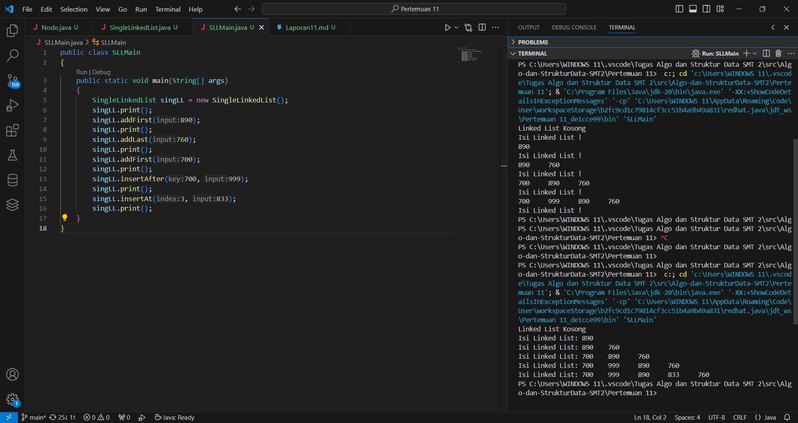
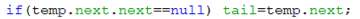
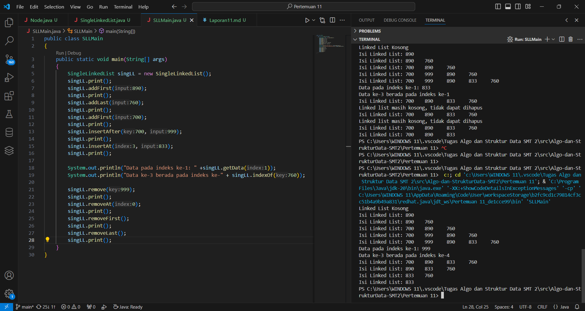
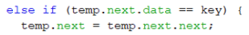
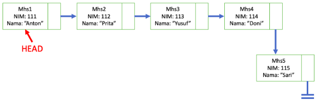
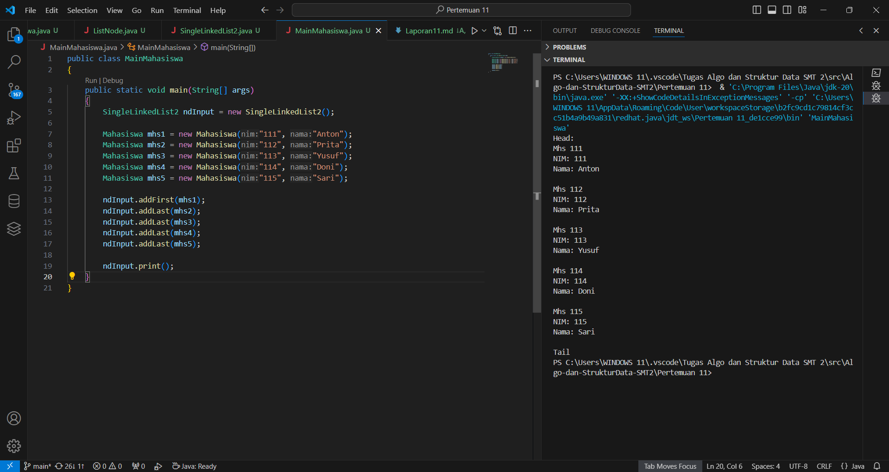

# Jobsheet 9 (Linked List)
Nama: Achmad Maulana Hamzah

Kelas / Absen: TI 1H / 02

NIM: 2341720172

## 1.1 Tujuan Praktikum
Setelah melakukan materi praktikum ini, mahasiswa mampu:
1. Membuat struktur data linked list
2. Membuat linked list pada program
3. Membedakan permasalahan apa yang dapat diselesaikan menggunakan linked list

## 1.2 Pembuatan Single Linked List
### 1.2.1 Verifikasi Hasil Praktikum

### 1.2.2 Pertanyaan
1. Mengapa hasil compile kode program di baris pertama menghasilkan “Linked List Kosong”?

Jawaban: 

Permasalahannya terletak di method isEmpty() yang digunakan untuk mengecek apakah linked list kosong. Dalam konteks ini, head akan menjadi null hanya jika linked list masih kosong. Jika linked list sudah memiliki minimal satu node, head akan menunjuk pada node pertama.

Namun, ketika kita memanggil method print() dalam program utama setelah membuat objek SingleLinkedList, head masih belum diinisialisasi (masih null), sehingga method isEmpty() mengembalikan true, dan pesan "Linked List Kosong" dicetak.

2. Jelaskan kegunaan variable temp secara umum pada setiap method!

Jawaban:

Variabel temp adalah singkatan dari "temporary" atau "temporary variable", yang artinya variabel sementara. Biasanya, variabel ini digunakan untuk menyimpan referensi sementara atau iterasi saat menjelajahi struktur data seperti linked list.

3. Perhatikan class SingleLinkedList, pada method insertAt Jelaskan kegunaan kode berikut

Jawaban:

Dalam metode insertAt(int index, int input), kode if (temp.next.next == null) digunakan untuk memeriksa apakah node yang ditambahkan akan menjadi node terakhir dalam linked list setelah proses penyisipan.

## 1.3 Modifikasi Elemen pada Single Linked List
### 1.3.1 Verifikasi Hasil Praktikum

### 1.3.2 Pertanyaan
1. Mengapa digunakan keyword break pada fungsi remove? Jelaskan!

Jawaban:

Keyword break digunakan dalam metode remove(int key) untuk menghentikan iterasi melalui linked list setelah node yang sesuai dengan nilai key ditemukan dan dihapus. Tanpa penggunaan break, iterasi akan terus dilanjutkan bahkan setelah node yang sesuai ditemukan dan dihapus, yang dapat menyebabkan waktu yang sia-sia dan potensi kesalahan dalam operasi penghapusan.

Penggunaan break ini mengindikasikan bahwa operasi penghapusan telah selesai dan tidak perlu melanjutkan iterasi lebih jauh. Itu memungkinkan kita untuk keluar dari loop saat kita telah mencapai kondisi yang diinginkan, mengoptimalkan kinerja dan memastikan bahwa operasi penghapusan dilakukan dengan benar.

2. Jelaskan kegunaan kode dibawah pada method remove!

Jawaban:

Dalam metode remove(int key), kode else if (temp.next.data == key) digunakan untuk menemukan node yang memiliki nilai yang sama dengan key setelah node saat ini (temp). Setelah node yang sesuai ditemukan, operasi ini menghapus node tersebut dari linked list dengan mengatur next dari node saat ini (temp) ke node setelah node yang akan dihapus (temp.next.next).

## 1.4 Tugas
1. Implementasikan ilustrasi Linked List Berikut. Gunakan 4 macam penambahan data yang telah
dipelajari sebelumnya untuk menginputkan data.

Jawaban:

2. Buatlah implementasi program antrian layanan unit kemahasiswaan sesuai dengan kondisi yang
ditunjukkan pada soal nomor 1! Ketentuan

a. Implementasi antrian menggunakan Queue berbasis Linked List!

b. Program merupakan proyek baru, bukan modifikasi dari soal nomor 1!