# Laporan JOBSHEET 10 - Double Linked Lists
Nama    : Achmad Maulana Hamzah

Kelas   : TI 1H

Absen   : 02

NIM     : 2341720172

## 1. Tujuan Praktikum
Setelah melakukan praktikum ini, mahasiswa mampu: 
1.	memahami algoritma double linked lists; 
2.	membuat dan mendeklarasikan struktur algoritma double linked lists; 
3.	menerapkan algoritma double linked lists dalam beberapa study case.

## 2. Kegiatan Praktikum

### 2.1 Praktikum 1
#### 2.1.1 Verifikasi Hasil Praktikum
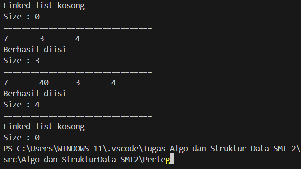

#### 2.1.2 Pertanyaan
1.	Jelaskan perbedaan antara single linked list dengan double linked lists!

Jawaban:
Single Linked List hanya terdapat data dan next saja pada node, sedangkan Double Linked List terdapat prev, data, dan next.

2.	Perhatikan class Node, di dalamnya terdapat atribut next dan prev. Untuk apakah atribut tersebut? 

Jawaban:
Next digunakan untuk merujuk data selanjutnya pada node, sedangkan prev digunakan untuk merujuk data sebelumnya pada node.

3.	Perhatikan konstruktor pada class DoubleLinkedLists. Apa kegunaan inisialisasi atribut head dan size seperti pada gambar berikut ini? 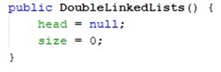

Jawaban: Dengan mengatur head ke null, konstruktor memastikan bahwa saat objek linked list baru dibuat, tidak ada node yang terhubung. Ini menghasilkan linked list kosong pada awalnya.

4.	Pada method addFirst(), kenapa dalam pembuatan object dari konstruktor class Node prev dianggap sama dengan null? 
Node newNode = new Node(null, item, head); 

Jawaban: Pada metode addFirst(), ketika menambahkan elemen baru di awal linked list, kita ingin node baru tersebut menjadi node pertama dalam daftar, yang berarti tidak ada node sebelumnya (karena ini adalah penambahan di awal). Oleh karena itu, kita meneruskan null sebagai argumen untuk parameter prev ketika membuat node baru.

5.	Perhatikan pada method addFirst().  Apakah arti statement head.prev = newNode ? 

Jawaban: Jadi, statement head.prev = newNode mengatur referensi prev dari node yang saat ini menjadi kepala (head) ke node baru yang sedang ditambahkan (newNode). Dengan kata lain, ini menghubungkan kepala sebelumnya dengan node baru, menempatkannya sebagai node sebelumnya dalam urutan linked list, membuat linked list menjadi terhubung ke node baru ini secara tepat.

6.	Perhatikan isi method addLast(), apa arti dari pembuatan object Node dengan mengisikan parameter prev dengan current, dan next dengan null? 
Node newNode = new Node(current, item, null);  

Jawaban: Dalam method addLast(), ketika kita menambahkan elemen baru di akhir linked list, kita ingin node baru tersebut menjadi node terakhir dalam daftar, yang berarti tidak ada node setelahnya (karena ini adalah penambahan di akhir). Oleh karena itu, kita meneruskan null sebagai argumen untuk parameter next ketika membuat node baru.

Namun, dalam konteks ini, kita ingin node baru tersebut menjadi node setelah node terakhir yang ada dalam linked list saat ini. Oleh karena itu, kita meneruskan referensi ke node terakhir tersebut sebagai argumen untuk parameter prev, sehingga node baru ini akan menjadi node setelah node terakhir yang ada.

Jadi, statement Node newNode = new Node(current, item, null); dalam method addLast() berarti:

current: Merupakan referensi ke node terakhir dalam linked list saat ini. Kita ingin membuat node baru ini menjadi node setelah node ini.
item: Merupakan data yang ingin kita sisipkan ke dalam node baru.
null: Karena node baru akan menjadi node terakhir, tidak ada node setelahnya, sehingga kita meneruskan null sebagai argumen untuk parameter next.

7.	Pada method add(), terdapat potongan kode program sebagai berikut: 
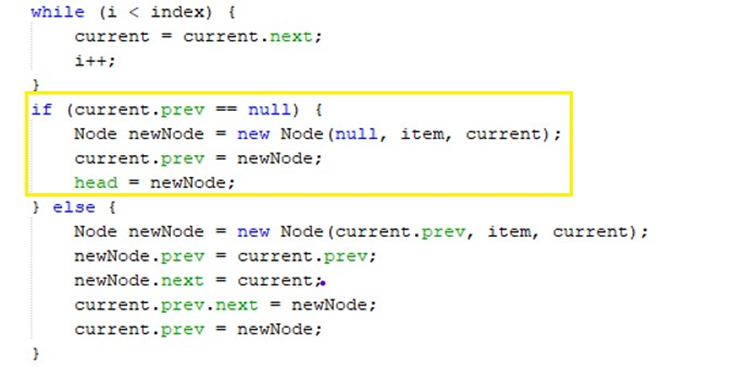
jelaskan maksud dari bagian yang ditandai dengan kotak kuning.

Jawaban: Ketika current.prev == null, ini berarti kita sedang memeriksa apakah kita berada di awal linked list. Jika current.prev adalah null, artinya current adalah node pertama dalam linked list. Ini berarti kita ingin menambahkan elemen baru di indeks pertama.

### 2.2 Praktikum 2

#### 2.2.1 Verifikasi Hasil Praktikum
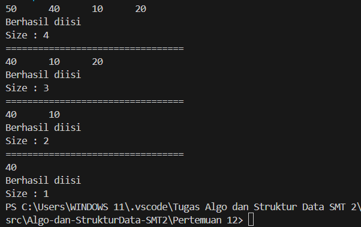

#### 2.2.2 Pertanyaan
1.	Apakah maksud statement berikut pada method removeFirst()? 
head = head.next; head.prev = null; 

Jawaban: statement head.prev = null; mengatur referensi prev dari node yang baru menjadi kepala baru (head) menjadi null, menandakan bahwa node ini sekarang adalah node pertama dalam linked list dan tidak memiliki node sebelumnya. Dengan mengatur prev menjadi null, kita memastikan bahwa tidak ada referensi yang menunjuk ke node yang sebelumnya adalah node pertama, sehingga node ini menjadi node pertama yang sebenarnya dalam linked list

2.	Bagaimana cara mendeteksi posisi data ada pada bagian akhir pada method removeLast()? 

Jawaban: Untuk mendeteksi apakah data berada di bagian akhir linked list pada method removeLast(), kita perlu melakukan iterasi melalui linked list untuk mencapai node terakhir. Kemudian, kita periksa apakah node berikutnya setelah node terakhir tersebut (current.next) adalah null. Jika iya, itu berarti kita berada di bagian akhir linked list.

3.	Jelaskan alasan potongan kode program di bawah ini tidak cocok untuk perintah remove! 
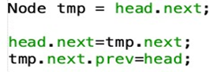

Jawaban: Potongan kode program tersebut tidak cocok untuk perintah remove, karena potongan kode tersebut secara tidak langsung menghapus node yang diinginkan tanpa memberikan cara untuk membebaskannya dari memori.

4.	Jelaskan fungsi kode program berikut ini pada fungsi remove! 
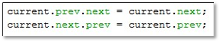

Jawaban: potongan kode tersebut secara efektif menghapus current dari linked list dengan memutuskan hubungan prev dan next-nya dengan node sebelum dan sesudahnya, dan kemudian menghubungkan node sebelum dan sesudahnya secara langsung. Ini adalah langkah yang benar dalam menghapus node dari linked list ganda, memastikan bahwa linked list tetap terhubung dengan benar setelah penghapusan.

### 2.3 Praktikum 3

#### Verifikasi Hasil Praktikum
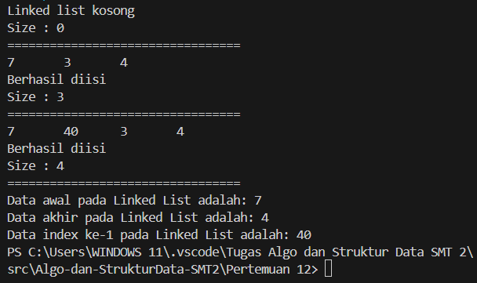

#### Pertanyaan
1.	Jelaskan method size() pada class DoubleLinkedLists! 

Jawaban: Method size() pada class DoubleLinkedLists adalah metode yang digunakan untuk mengembalikan jumlah elemen (ukuran) dalam linked list. Ini cukup sederhana, karena nilai ukuran disimpan dalam variabel size dalam class DoubleLinkedLists, sehingga metode size() hanya perlu mengembalikan nilai dari variabel size.

2.	Jelaskan cara mengatur indeks pada double linked lists supaya dapat dimulai dari indeks ke- 1! 

Jawaban: Untuk mengatur indeks pada double linked lists agar dapat dimulai dari indeks ke-1, Anda perlu memodifikasi operasi tambah (add) dan hapus (remove) serta operasi lain yang melibatkan indeks. Berikut adalah langkah-langkah yang dapat Anda ikuti:

Modifikasi Operasi Add:
Saat menambahkan elemen pertama dengan addFirst(), indeksnya tetap 1.
Saat menambahkan elemen di posisi lain menggunakan add(int item, int index), perhatikan bahwa kita harus menyesuaikan pengindeksan sehingga indeks ke-1 sesuai dengan node pertama. Jadi, indeks ke-1 dalam linked list akan merujuk pada node pertama.

Modifikasi Operasi Remove:
Modifikasi operasi penghapusan untuk menyesuaikan pengindeksan sehingga indeks ke-1 merujuk pada node pertama.

Modifikasi Operasi Get:
Saat mengakses elemen dengan indeks menggunakan get(int index), kita perlu memastikan bahwa elemen pertama memiliki indeks 1.

3.	Jelaskan perbedaan karakteristik fungsi Add pada Double Linked Lists dan Single Linked Lists!  

Jawaban:

Double Linked Lists:

Pada double linked lists, setiap node memiliki dua pointer atau referensi, yaitu prev dan next, yang menunjukkan node sebelum dan sesudahnya.
Saat menambahkan node baru di posisi tertentu dalam double linked lists, Anda perlu mengatur empat referensi: prev dari node baru, next dari node baru, next dari node sebelumnya, dan prev dari node sesudahnya.
Penambahan di awal dan akhir linked list relatif mudah dalam double linked lists karena Anda dapat dengan mudah mengatur referensi next dan prev dari node-node yang terlibat.

Single Linked Lists:

Pada single linked lists, setiap node hanya memiliki satu pointer atau referensi yang menunjukkan node berikutnya dalam linked list.
Saat menambahkan node baru di posisi tertentu dalam single linked lists, Anda perlu mengatur tiga referensi: next dari node baru, next dari node sebelumnya, dan next dari node yang baru saja ditambahkan.
Karena single linked lists hanya memiliki satu referensi untuk setiap node, mengakses node sebelumnya dari suatu node tidaklah langsung. Ini membuat operasi seperti menambah atau menghapus di akhir linked list membutuhkan iterasi melalui linked list untuk mencapai node terakhir sebelum node baru dapat disisipkan atau dihapus.

4.	Jelaskan perbedaan logika dari kedua kode program di bawah ini!
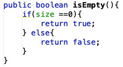
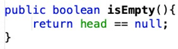

Jawaban: 

Pada kode program pertama, menggunakan size sebagai indikasinya. linked list dianggap kosong jika size (ukuran) dari linked list adalah 0. Jadi, metode ini secara langsung memeriksa nilai size dan mengembalikan true jika size adalah 0, yang menunjukkan bahwa linked list kosong, dan mengembalikan false jika size bukan 0, menunjukkan bahwa linked list tidak kosong. Ini adalah pendekatan yang cukup jelas dan mudah dipahami.

Pada kode program kedua, menggunakan head sebagai indikasinya. linked list dianggap kosong jika head dari linked list adalah null. Artinya, jika tidak ada node pertama (tidak ada head), linked list dianggap kosong. Jadi, metode ini secara langsung memeriksa apakah head adalah null atau tidak, dan mengembalikan true jika head adalah null, yang menunjukkan bahwa linked list kosong, dan false jika head tidak null, menunjukkan bahwa linked list tidak kosong. Pendekatan ini lebih langsung dan efisien karena hanya memeriksa satu variabel, yaitu head.

## 3. Tugas Praktikum
1. Buat program antrian vaksinasi menggunakan queue berbasis double linked list sesuai ilustrasi dan menu di bawah ini! (counter jumlah antrian tersisa di menu cetak(3) dan data orang yang telah divaksinasi di menu Hapus Data(2) harus ada)

Jawaban:

Terdapat 3 class yang telah dibuat yaitu:

Class Node

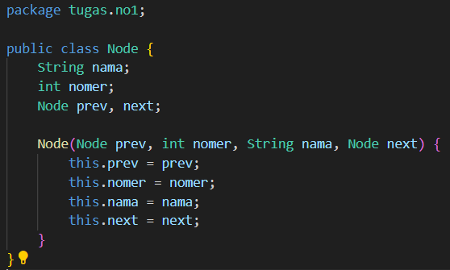

Class DLLVaksinasi (menggunakan Queue)

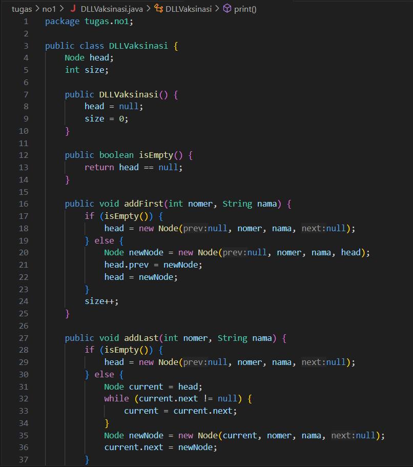

class VaksinasiMain

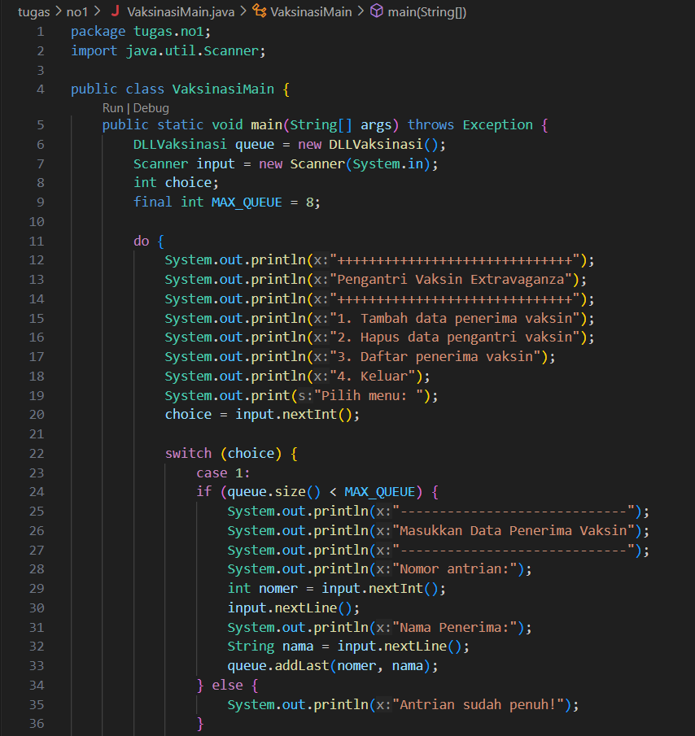

Hasil output pada program:

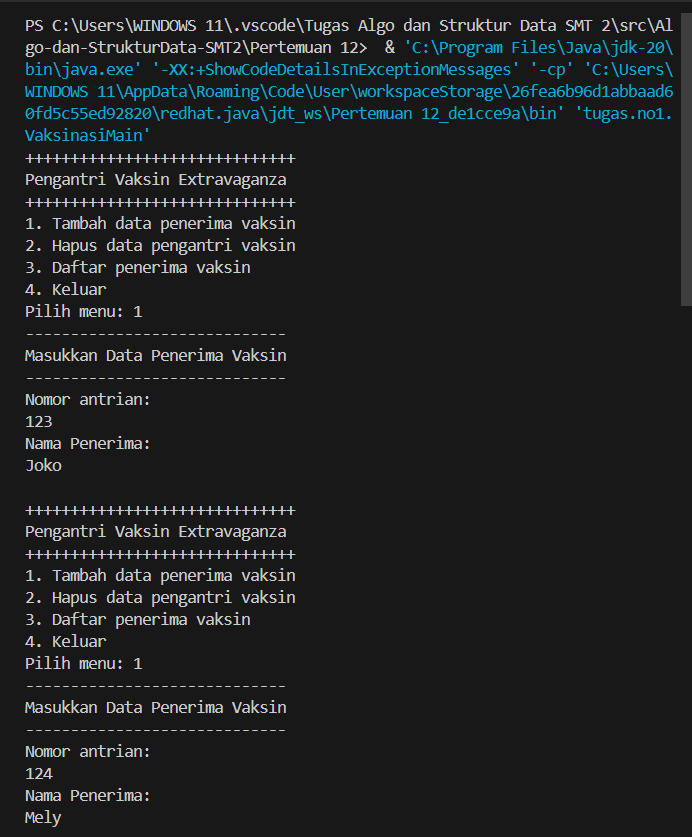
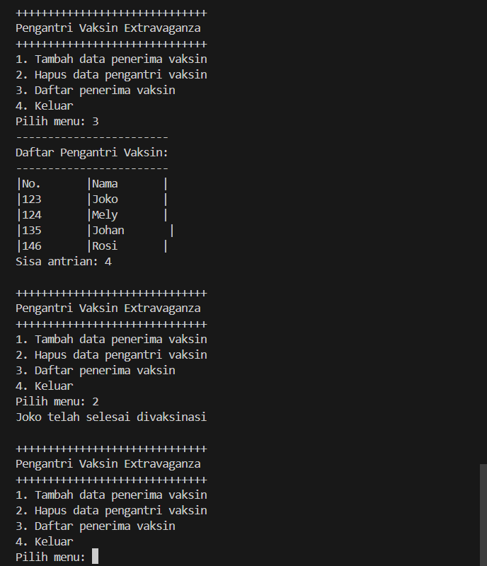

2. Buatlah program daftar film yang terdiri dari id, judul dan rating menggunakan double linked
lists, bentuk program memiliki fitur pencarian melalui ID Film dan pengurutan Rating secara
descending. Class Film wajib diimplementasikan dalam soal ini.

Jawaban:

Terdapat 3 class yang telah dibuat yaitu:

Class Node:

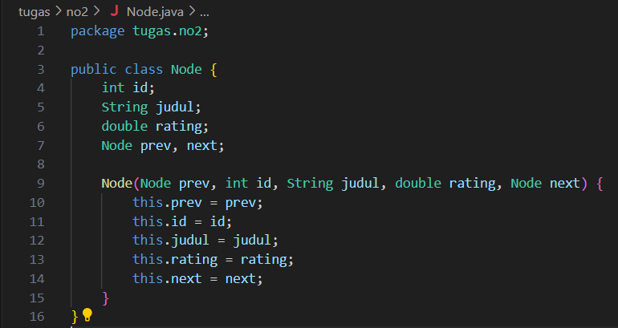

Class DLLFilm:

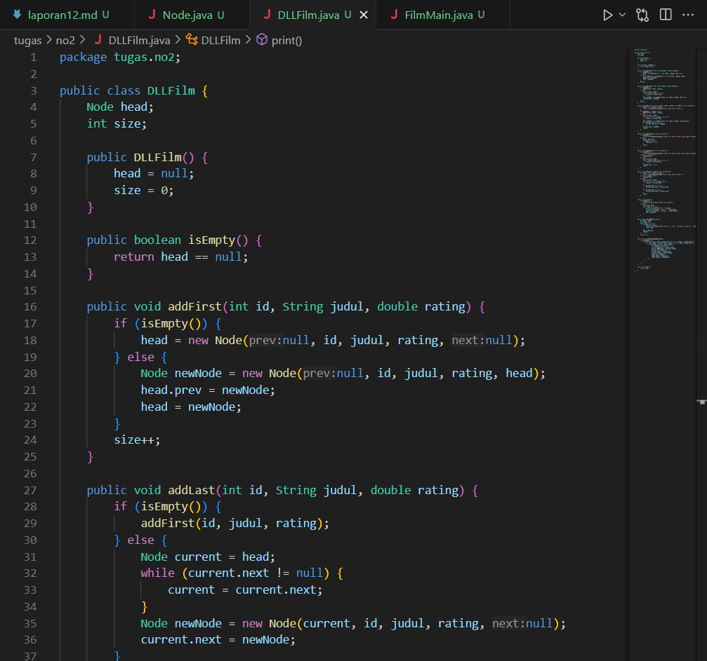

Class FilmMain:

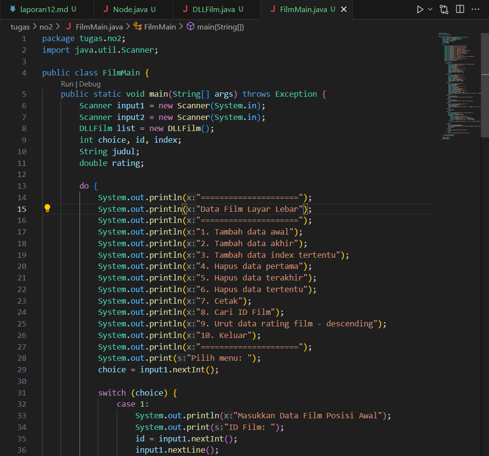

Hasil output:

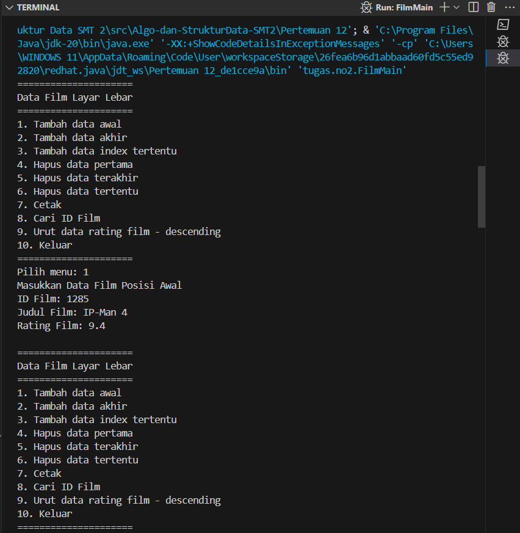
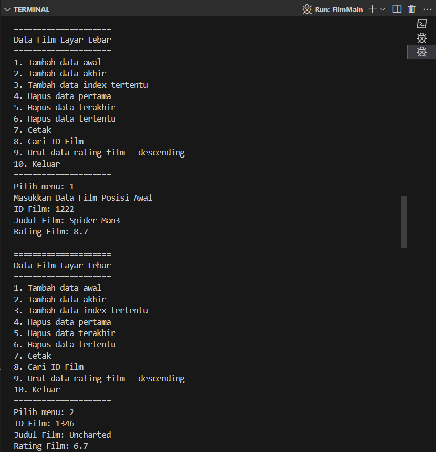
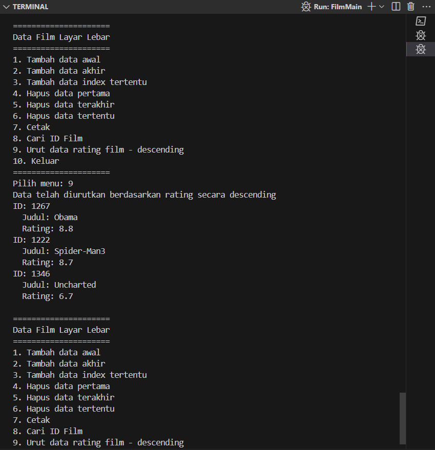
