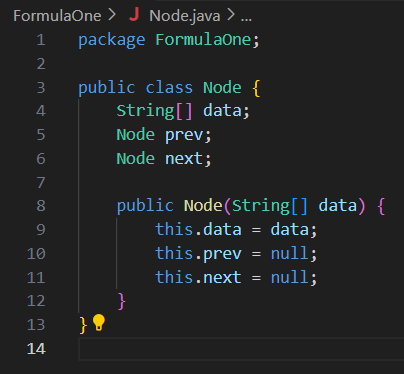
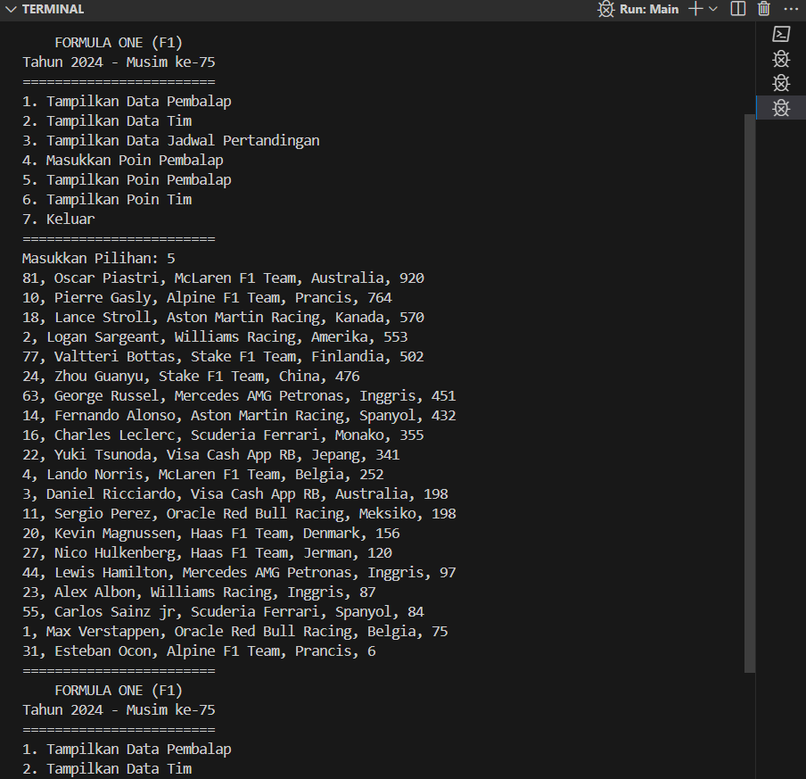

# Kuis 2 – Praktikum Algoritma dan Struktur Data

Nama: Achmad Maulana Hamzah

Absen: 02

kelas: 1H

NIM: 2341720172

Prodi: D-IV Teknik Informatika

## Soal
1. Buat simulasi klasemen berdasarkan kasus dan struktur data yang diminta sesuai
pembagian per mahasiswa! Harap proses penghitungan klasemen telah dipelajari
sehingga soal yang dikerjakan sesuai dengan kasus nyata!
2. Harus berbasis obyek, tidak diperbolehkan menggunakan pendekatan
procedural!

## Petunjuk
1. Setiap klub atau tim dapat direpresentasikan sebagai sebuah node
2. Dikumpulkan di Repo GitHub (bukan repo baru)
3. Perhatikan deadline!

## Kode Program
Disini saya menggunakan 3 class untuk kuis ini, yaitu
1. Class Node

2. Class DoubleLinkedList

3. Class Main

## Hasil Output
Karena terdapat 6 pilihan menu, maka saya akan menampilkan ke-6 menu tersebut

Hasil output:

Menu 1

Menu 2

Menu 3

Menu 4

Menu 5

Menu 6

