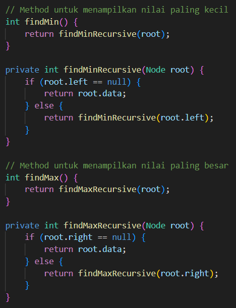

# Laporan Jobsheet 13 - Tree
Nama: Achmad Maulana Hamzah

Kelas: 1H

Absen: 02

Prodi: D-IV Teknik Informatika

## 1.1 Tujuan Praktikum
Setelah melakukan praktikum ini, mahasiswa mampu:
1. memahami model Tree khususnya Binary Tree
2. membuat dan mendeklarasikan struktur algoritma Binary Tree.
3. menerapkan dan mengimplementasikan algoritma Binary Tree dalam kasus Binary Search
Tree

## 1.2 Kegiatan Praktikum
Implementasi Binary Search Tree menggunakan Linked List (45 Menit)

### 1.2.1 Percobaan 1
#### 1.2.1.1 Hasil Verifikasi Praktikum

#### 1.2.1.2 Pertanyaan
1. Mengapa dalam binary search tree proses pencarian data bisa lebih efektif dilakukan dibanding
binary tree biasa?

Jawaban: BST lebih efektif untuk pencarian data dibandingkan binary tree biasa karena struktur binary search tree yang teratur (pengurutan berdasarkan nilai) memungkinkan kita untuk mengabaikan setengah dari pohon pada setiap langkah pencarian serta kompleksitas waktu pencarian pada binary search tree yang seimbang adalah O(log n), yang jauh lebih efisien dibandingkan O(n) pada binary tree biasa.

2. Untuk apakah di class Node, kegunaan dari atribut left dan right?

Jawaban: Di dalam kelas Node pada implementasi pohon biner seperti Node02, atribut left dan right digunakan untuk menunjuk ke anak kiri dan anak kanan dari node tersebut.

3. a. Untuk apakah kegunaan dari atribut root di dalam class BinaryTree?

Jawaban: Atribut root dalam class BinaryTree memiliki peran yang sangat penting sebagai titik masuk utama untuk semua operasi yang dilakukan pada pohon biner atau binary search tree

b. Ketika objek tree pertama kali dibuat, apakah nilai dari root?

Jawaban: Nilai dari root adalah 6

4. Ketika tree masih kosong, dan akan ditambahkan sebuah node baru, proses apa yang akan terjadi?

Jawaban: Proses method add akan terjadi untuk menambahkan data kedalam node baru

5. Perhatikan method add(), di dalamnya terdapat baris program seperti di bawah ini. Jelaskan
secara detil untuk apa baris program tersebut?

if(data<current.data){
    if(current.left!=null){
        current = current.left;
    }else{
    current.left = new Node(data);
    break;
    }
}

Jawaban:

1. Kondisi if(data < current.data): Baris ini memeriksa apakah nilai data yang ingin ditambahkan (data) lebih kecil daripada nilai data di node saat ini (current.data).
2. Kondisi if(current.left != null): Setelah memutuskan bahwa data lebih kecil dan kita harus bergerak ke kiri, kita perlu memeriksa apakah anak kiri (left) dari node saat ini (current) adalah null atau tidak. Jika current.left != null, berarti ada node anak di sebelah kiri, dan kita harus melanjutkan penelusuran dengan berpindah ke node tersebut. Ini dilakukan dengan menetapkan current ke current.left.
3. current = current.left;: Baris ini mengupdate current untuk menunjuk ke node anak kiri. Proses penelusuran atau pencarian lokasi untuk node baru dilanjutkan dari node anak kiri ini. Selanjutnya, loop while (true) akan berlanjut dengan node baru sebagai current, dan proses pemeriksaan ulang apakah data lebih kecil atau lebih besar dari current.data diulang.
4. current.left = new Node02(data);: Jika current.left == null, berarti tidak ada node anak di sebelah kiri, dan kita telah menemukan lokasi yang tepat untuk menambahkan node baru. Baris ini membuat node baru dengan nilai data dan menetapkannya sebagai anak kiri dari node saat ini (current.left).
5. break;: Setelah menambahkan node baru, loop while (true) dihentikan dengan break.

### 1.2.2 Percobaan 2

#### 1.2.2.1 Hasil Verifikasi Praktikum

#### 1.2.2.2 Pertanyaan
1. Apakah kegunaan dari atribut data dan idxLast yang ada di class BinaryTreeArray?

Jawaban: Atribut data merupakan array yang digunakan untuk menyimpan nilai dari setiap node dalam pohon biner yang direpresentasikan menggunakan array. Atribut idxLast menunjukkan indeks dari elemen terakhir dalam array yang digunakan untuk menyimpan nilai dari node dalam pohon, ini membantu dalam mengetahui batas atau jangkauan nilai yang valid dalam array data.

2. Apakah kegunaan dari method populateData()?

Jawaban: Dapat mengisi data ke dalam objek BinaryTreeArray02 dengan mudah dan efisien. Ini memungkinkan kita untuk mempersiapkan pohon biner untuk operasi-operasi seperti traversal atau pencarian dengan menyediakan nilai-nilai yang sesuai ke dalam representasi array dari pohon.

3. Apakah kegunaan dari method traverseInOrder()?

Jawaban: Dapat melakukan traversal in-order pada pohon biner yang direpresentasikan menggunakan array dengan mudah dan efisien. Ini memungkinkan kita untuk memproses nilai-nilai dari setiap node dalam urutan yang tepat sesuai dengan aturan traversal in-order.

4. Jika suatu node binary tree disimpan dalam array indeks 2, maka di indeks berapakah posisi
left child dan rigth child masin-masing?

Jawaban: Left child menggunakan rumus 'traverseInOrder(2*idxStart+1);', sehingga untuk indeks 2, left childnya berada di indeks ke 2*2+1 = 5. Right child menggunakan rumus 'traverseInOrder(2*idxStart+2);', sehingga untuk indeks 2, right childnya berada di indeks ke 2*2=2 = 6;

5. Apa kegunaan statement int idxLast = 6 pada praktikum 2 percobaan nomor 4?

Jawaban: Untuk mengubah node akhir dari array menjadi angka 6.

## 1.3 Tugas Praktikum
1. Buat method di dalam class BinaryTree yang akan menambahkan node dengan cara
rekursif.

Jawaban:

2. Buat method di dalam class BinaryTree untuk menampilkan nilai paling kecil dan yang
paling besar yang ada di dalam tree.

Jawaban:

3. Buat method di dalam class BinaryTree untuk menampilkan data yang ada di leaf.

Jawaban:

4. Buat method di dalam class BinaryTree untuk menampilkan berapa jumlah leaf yang ada
di dalam tree.

Jawaban:

5. Modifikasi class BinaryTreeArray, dan tambahkan :

• method add(int data) untuk memasukan data ke dalam tree

• method traversePreOrder() dan traversePostOrder()

Jawaban:

1. 
2. 