# Laporan Jobsheet 14 - Graph
Nama: Achmad Maulana Hamzah

Kelas: 1H

Absen: 02

Prodi: D-IV Teknik Informatika

## 1. Tujuan Praktikum
Setelah melakukan praktikum ini, mahasiswa mampu:
1. memahami model graph
2. membuat dan mendeklarasikan struktur algoritma graph
3. menerapkan algoritma dasar graph dalam beberapa studi kasus

## 2. Praktikum
### 2.1 Percobaan 1: Implementasi Graph menggunakan Linked List
#### 2.1.1 Hasil verifikasi
Hasil running pada langkah 14
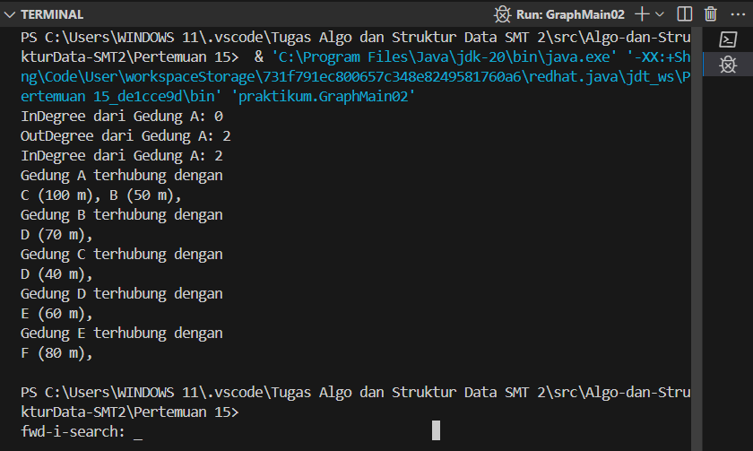

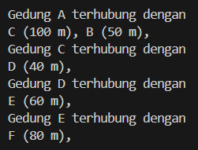

Hasil running pada langkah 17

#### 2.1.2 Pertanyaan
1. Perbaiki kode program Anda apabila terdapat error atau hasil kompilasi kode tidak sesuai!
2. Pada class Graph, terdapat atribut list[] bertipe DoubleLinkedList. Sebutkan tujuan pembuatan
variabel tersebut!

Jawaban:

Variabel list[] bertipe DoubleLinkedList pada kelas Graph digunakan untuk merepresentasikan graf dalam representasi adjacency list.

Tujuan pembuatannya adalah untuk menyimpan daftar node-node yang terhubung dari setiap node tertentu dalam graf. Dengan menggunakan DoubleLinkedList, setiap elemen dari array list[] dapat menyimpan daftar tetangga-tetangga dari suatu node dalam urutan yang mudah diakses.

3. Jelaskan alur kerja dari method removeEdge!

Jawaban:

Metode removeEdge() digunakan untuk menghapus sisi antara dua node dalam graf. Berikut adalah alur kerja dari metode removeEdge():

- Input Parameter: Metode removeEdge() menerima dua parameter, yaitu asal dan tujuan, yang mewakili node-node yang terhubung oleh sisi yang akan dihapus.

- Pencarian Sisi: Metode ini melakukan pencarian sisi yang menghubungkan node asal dan tujuan. Ini dilakukan dengan mencari node tujuan dalam daftar tetangga node asal, dan sebaliknya, yaitu mencari node asal dalam daftar tetangga node tujuan.

- Penghapusan Sisi: Setelah sisi yang bersangkutan ditemukan, metode removeEdge() menghapus sisi tersebut dari daftar tetangga node asal dan tujuan. Ini dilakukan dengan menghapus referensi ke node tetangga yang sesuai dari kedua daftar tetangga.

- Penanganan Kasus Khusus: Metode ini juga menangani kasus khusus, seperti jika sisi yang akan dihapus adalah satu-satunya sisi yang menghubungkan dua node. Dalam kasus tersebut, metode ini harus memastikan bahwa kedua node tetap terpisah setelah sisi dihapus.

- Penanganan Kesalahan: Metode removeEdge() juga harus menangani situasi di mana sisi yang dimaksud tidak ditemukan antara node asal dan tujuan. Dalam hal ini, metode ini mungkin tidak melakukan apa pun, atau dapat memberikan pesan kesalahan untuk menginformasikan bahwa sisi yang dimaksud tidak ada.

4. Apakah alasan pemanggilan method addFirst() untuk menambahkan data, bukan method add
jenis lain saat digunakan pada method addEdge pada class Graph?

Jawaban:

Pemanggilan metode addFirst() daripada metode penambahan lainnya seperti addLast() atau add() dalam metode addEdge() pada kelas Graph mungkin disebabkan oleh beberapa alasan sebagai berikut:

1. Efisiensi Penambahan: Metode addFirst() mungkin dipilih untuk memperoleh kecepatan penambahan yang optimal. Dalam representasi adjacency list, biasanya kita ingin menambahkan node baru ke awal daftar tetangga untuk meningkatkan efisiensi pencarian dan traversing.

2. Pemeliharaan Urutan: Penggunaan addFirst() memastikan bahwa node baru ditambahkan di awal daftar tetangga, yang dapat membantu dalam memelihara urutan node-node tetangga sesuai dengan urutan penambahan mereka. Ini mungkin berguna dalam skenario di mana urutan node tetangga memiliki arti atau relevansi tertentu.

5. Modifikasi kode program sehingga dapat dilakukan pengecekan apakah terdapat jalur antara
suatu node dengan node lainnya, seperti contoh berikut (Anda dapat memanfaatkan Scanner).
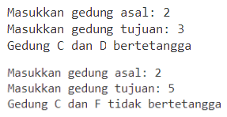

Jawaban:

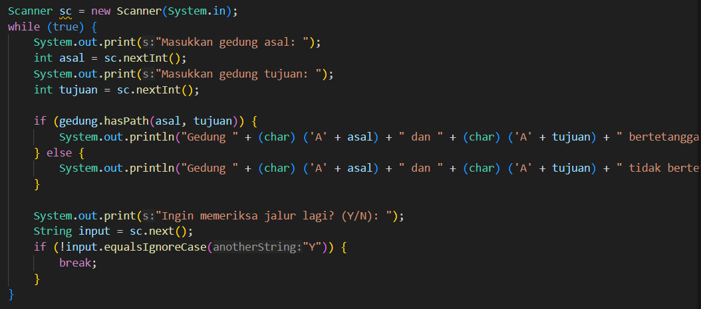

### 2.2 Percobaan 2: Implementasi Graph menggunakan Matriks
#### 2.2.1 verifikasi Hasil Praktikum

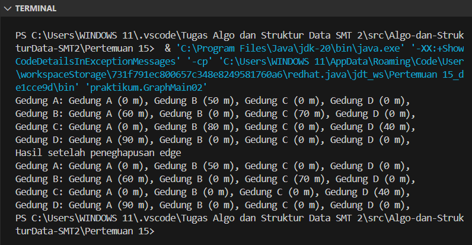

#### 2.2.2 Pertanyaan
1. Perbaiki kode program Anda apabila terdapat error atau hasil kompilasi kode tidak sesuai!

2. Apa jenis graph yang digunakan pada Percobaan 2?

Jawaban:

Jenis graf yang digunakan pada percobaan di atas adalah graf berarah (directed graph).

3. Apa maksud dari dua baris kode berikut?
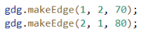

Jawaban: 

Gedung B ke Gedung C berjarak 70m, Gedung C ke Gedung B berjarak 80m.

4. Modifikasi kode program sehingga terdapat method untuk menghitung degree, termasuk
inDegree dan outDegree!

Jawaban:

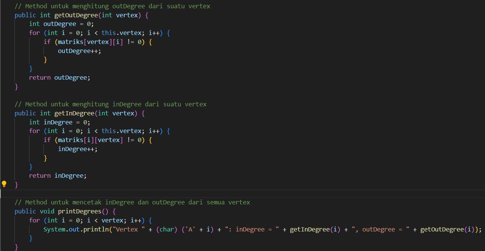
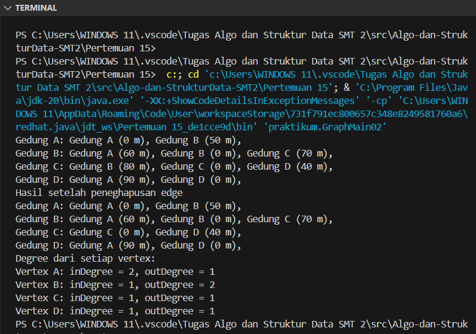

## Latihan Praktikum
1. Modifikasi kode program pada class GraphMain sehingga terdapat menu program yang bersifat
dinamis, setidaknya terdiri dari:

a) Add Edge
b) Remove Edge
c) Degree
d) Print Graph
e) Cek Edge

Pengguna dapat memilih menu program melalui input Scanner

Jawaban:

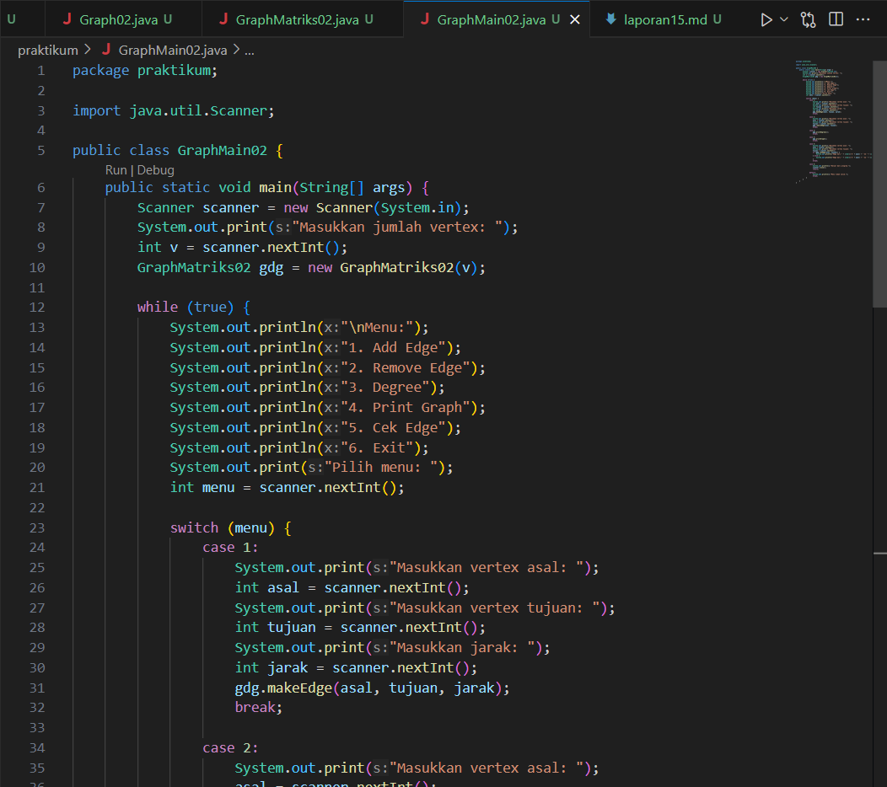

2. Tambahkan method updateJarak pada Percobaan 1 yang digunakan untuk mengubah jarak antara dua node asal dan tujuan!

Jawaban:

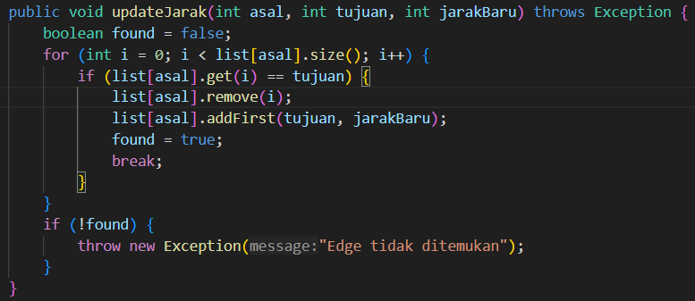

3. Tambahkan method hitungEdge untuk menghitung banyaknya edge yang terdapat di dalam graf!

Jawaban:

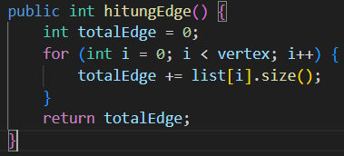