# Laporan Praktikum Pertemuan 2 (Jobsheet 2)
nama: Achmad Maulana Hamzah, 
prodi: D4TI, kelas: 1H, absen: 02
## 1. Tujuan Praktikum
Setelah melakukan materi praktikum ini, mahasiswa mampu:
1. Mengenal objek dan class sebagai konsep mendasar pada pemrograman berorientasi objek
2. Mendeklarasikan class, atribut dan method
3. Membuat objek (instansiasi)
4. Mengakses atribut dan method dari suatu objek
5. Menerapkan konstruktor
## 2. Praktikum
### 2.1 Percobaan 1: Deklarasi CLass, Atribut, dan Method

#### 2.1.1 Verifikasi hasil percobaan:
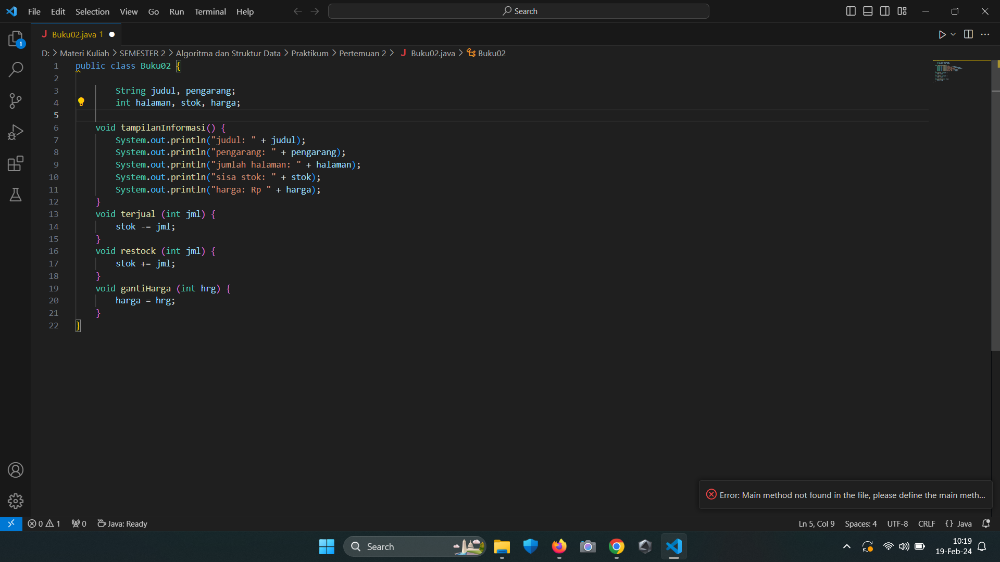

#### 2.1.2 Pertanyaan:
1. Sebutkan dua karakteristik class atau object!

Jawab: Class memiliki karakteristik yaitu abstraksi (permodelan) dan object, sedangkan object memiliki karakteristik yaitu attribute (variabel) dan behavior.

2. Perhatikan class Buku pada Praktikum 1 tersebut, ada berapa atribut yang dimiliki oleh class Buku? Sebutkan apa saja atributnya!

Jawab: ada 5 atribut. yaitu String judul, String pengarang, int halaman, int stok, int harga

3. Ada berapa method yang dimiliki oleh class tersebut? Sebutkan apa saja methodnya!

Jawab: ada 4 method. yaitu void tampilanInformasi(), void terjual(int jml), void restock(int jml), void gantiHarga(int hrg.)

4. Perhatikan method terjual() yang terdapat di dalam class Buku. Modifikasi isi method tersebut sehingga proses pengurangan hanya dapat dilakukan jika stok masih ada (lebih besar dari 0)!

Jawab: 

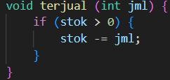

5. Menurut Anda, mengapa method restock() mempunyai satu parameter berupa bilangan int?

Jawab: 
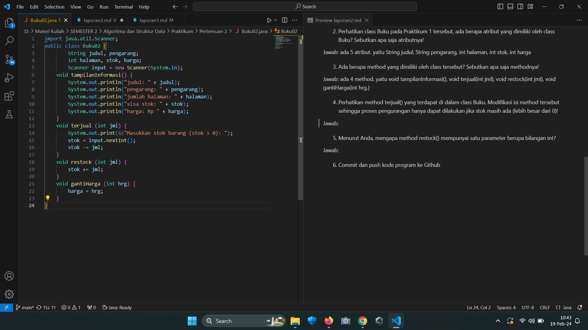

6. Commit dan push kode program ke Github

### 2.2 Percobaan 2: Instansiasi Object, serta Mengakses Atribut dan Method
#### 2.2.1 Verifikasi hasil percobaan:
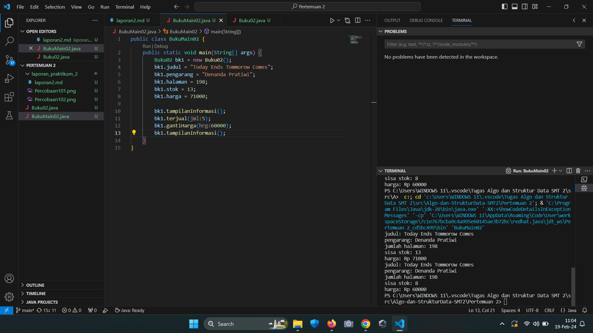

#### 2.2.2 Pertanyaan:
1. Pada class BukuMain, tunjukkan baris kode program yang digunakan untuk proses instansiasi! Apa nama object yang dihasilkan?

Jawab:

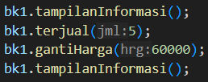

Nama objek yang dihasilkan adalah tampilanInformasi()

2. Bagaimana cara mengakses atribut dan method dari suatu objek?

Jawab: Untuk mengakses atribut, gunakan notasi nama_objek.nama_atribut. Sedangkan untuk memanggil method, gunakan notasi nama_objek.nama_method().

3. Mengapa hasil output pemanggilan method tampilInformasi() pertama dan kedua berbeda?

Jawab: method pertama sudah dituliskan pada kode program, sedangkan method kedua mengambil input dari kode program yang lain.

### 2.3 Percobaan 3: Membuat Konstruktor
#### 2.3.1 Verifikasi Hasil Percobaan
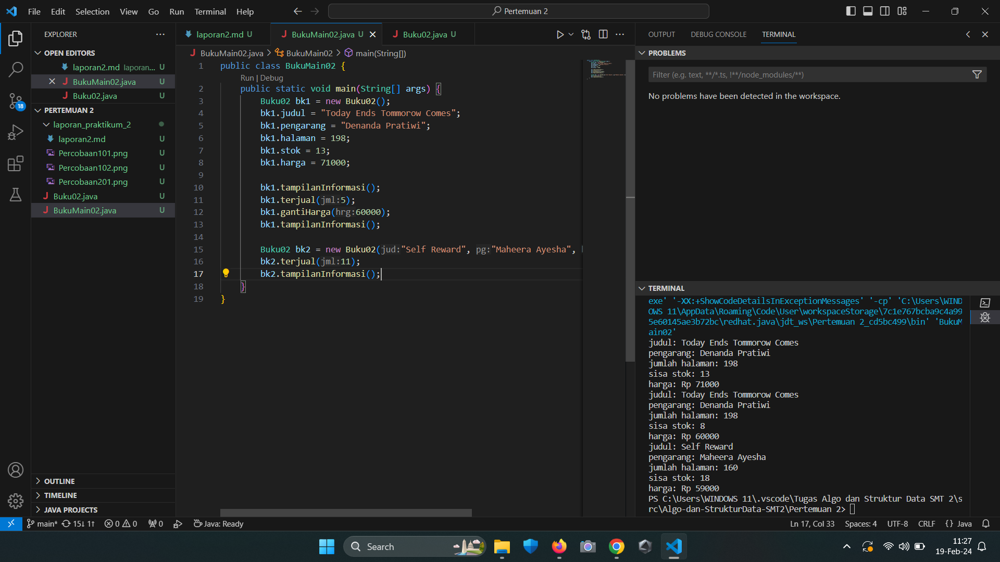

#### 2.3.2 Pertanyaan:
1. Pada class Buku di Percobaan 3, tunjukkan baris kode program yang digunakan untuk mendeklarasikan konstruktor berparameter!

Jawab:

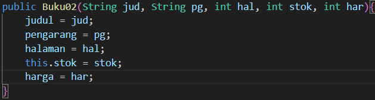

2. Perhatikan class BukuMain. Apa sebenarnya yang dilakukan pada baris program berikut?

Jawab: Menampilkan informasi buku seperti judul, pengarang, halaman, stok, dan harga.

3. Hapus konstruktor default pada class Buku, kemudian compile dan run program. Bagaimana hasilnya? Jelaskan mengapa hasilnya demikian!

Jawab: Program akan eror, karena konstruktor default diperlukan dalam class BukuMain untuk menampulkan output dari program.

4. Setelah melakukan instansiasi object, apakah method di dalam class Buku harus diakses secara berurutan? Jelaskan alasannya!

Jawab: Tidak, method di dalam class Buku tidak harus diakses secara berurutan setelah melakukan instansiasi object. Method dapat dipanggil  pada objek secara langsung tanpa harus memanggil semua method yang ada di dalam class secara berurutan. Pemanggilan method dilakukan berdasarkan kebutuhan program atau logika tertentu.

5. Buat object baru dengan nama buku<NamaMahasiswa> menggunakan konstruktor berparameter dari class Buku!

Jawab:

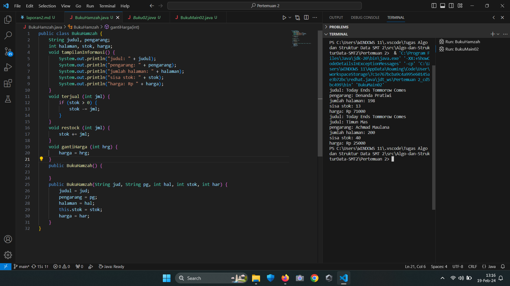

6. Commit dan push kode program ke Github

### 2.4 Latihan Praktikum
1. Pada class Buku yang telah dibuat, tambahkan tiga method yaitu hitungHargaTotal(), hitungDiskon(), dan hitungHargaBayar() dengan penjelasan sebagai berikut:

o Method hitungHargaTotal() digunakan untuk menghitung harga total yang merupakan perkalian antara harga dengan jumlah buku yang terjual

o Method hitungDiskon() digunakan untuk menghitung diskon dengan aturan berikut:

▪ Jika harga total lebih dari 150000, maka harga didiskon sebesar 12%

▪ Jika harga total antara 75000 sampai 150000, maka harga didiskon sebesar 5%

▪ Jika harga total kurang dari 75000, maka harga tidak didiskon

o Method hitungHargaBayar() digunakan untuk menghitung harga total setelah dikurangi diskon

#### 2.4.1 Verifikasi Hasil Praktikum

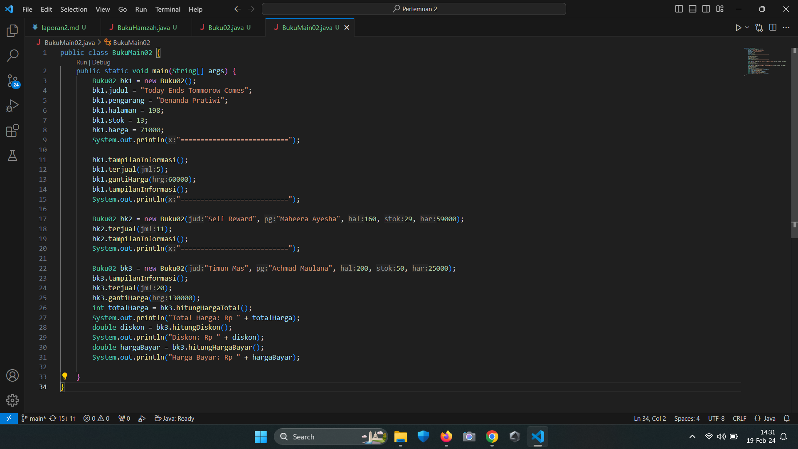
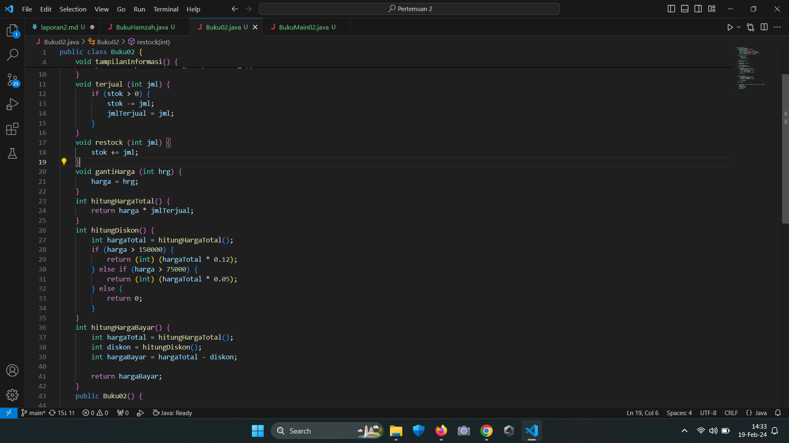
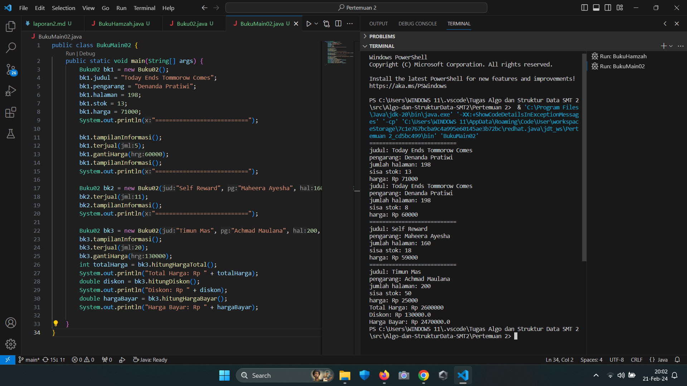

2. Buat program berdasarkan class diagram berikut ini!
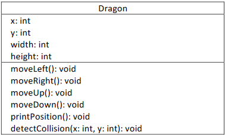

Penjelasan dari atribut dan method pada class Dragon tersebut adalah sebagai berikut:

• Atribut x digunakan untuk menyimpan posisi koordinat x (mendatar) dari dragon, sedangkan
atribut y untuk posisi koordinat y (vertikal)

• Atribut width digunakan untuk menyimpan lebar dari area permainan, sedangkan height
untuk menyimpan panjang area

• Method moveLeft() digunakan untuk mengubah posisi dragon ke kiri (koordinat x akan berkurang 1), sedangkan moveRight() untuk bergerak ke kanan (koordinat x akan bertambah 1). Perlu diperhatikan bahwa koordinat x tidak boleh lebih kecil dari 0 atau lebih besar dari nilai width. Jika koordinat x < 0 atau x > width maka panggil method detectCollision()

• Method moveUp() digunakan untuk mengubah posisi dragon ke atas (koordinat y akan berkurang 1), sedangkan moveDown() untuk bergerak ke bawah (koordinat y akan bertambah 1). Perlu diperhatikan bahwa koordinat y tidak boleh lebih kecil dari 0 atau lebih besar dari nilai height. Jika koordinat y < 0 atau y > height maka panggil method detectCollision()

• Method detectCollision() akan mencetak pesan “Game Over” apabila dragon menyentuh ujung area permainan.

#### 2.4.2 Verifikasi Hasil Praktikum
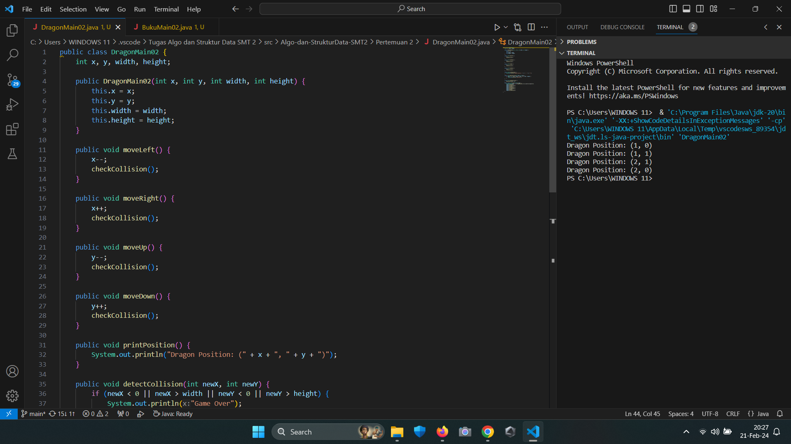
