# Laporan Praktikum Pertemuan 3 (Jobsheet 3)
nama: Achmad Maulana Hamzah
prodi: D4TI, kelas: 1H, absen: 02
## 1. Tujuan Praktikum
Setelah melakukan materi praktikum ini, mahasiswa mampu:
1. Memahami dan menjelaskan fungsi array yang berisikan variabel objek.
2. Mahasiswa mampu menangkap logika tentang permasalahan array of object dalam Java
3. Mahasiswa mampu menerapkan pembuatan array of object dalam Java

## 2. Praktikum

### 2.1 Percobaan 1: Membuat Array dari Object, Mengisi dan Menampilkan

#### 2.1.1 Verifikasi Hasil Percobaan:
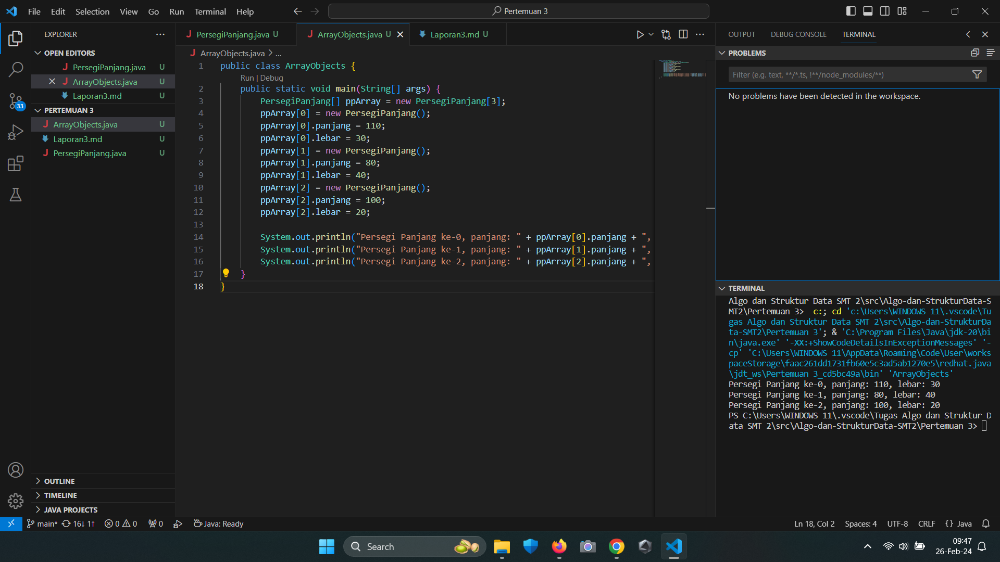

#### 2.1.2 Pertanyaan
1. Berdasarkan uji coba 3.2, apakah class yang akan dibuat array of object harus selalu memiliki
atribut dan sekaligus method?Jelaskan!

Jawab: Tidak, atribut dan method dapat dituliskan pada class yang terpisah asalkan harus pada class untuk method harus memasukkan class atribut.

2. Apakah class PersegiPanjang memiliki konstruktor?Jika tidak, kenapa dilakukan pemanggilan
konstruktur pada baris program berikut :

Jawab: Tidak, dilakukan pemanggilan konstruktor agar atribut pada class PersegiPanjang bisa sinkron dengan method pada class ArrayObjects.

3. Apa yang dimaksud dengan kode berikut ini:

Jawab: Membuat array dengan nama PersegiPanjang sebanyak 3 buah atau 2 index.

4. Apa yang dimaksud dengan kode berikut ini:

Jawab: Membuat masing masing index pada array PersegiPanjang memiliki isi

5. Mengapa class main dan juga class PersegiPanjang dipisahkan pada uji coba 3.2?

Jawab: Untuk memudahkan dalam pengerjaan method pada class main.

### 2.2 Percobaan 2: Menerima Input Isian Array Menggunakan Looping

#### 2.2.1 Verifikasi Hasil Percobaan:
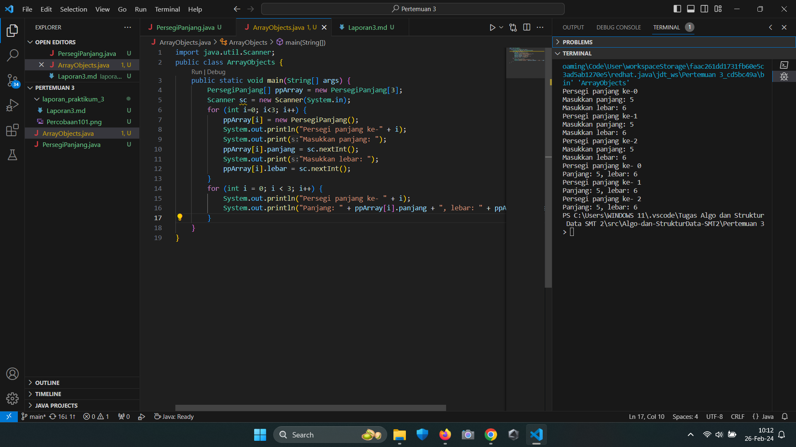

#### 2.2.2 Pertanyaan
1. Apakah array of object dapat diimplementasikan pada array 2 Dimensi?

Jawab: Bisa

2. Jika jawaban soal no satu iya, berikan contohnya! Jika tidak, jelaskan!

Jawab: 
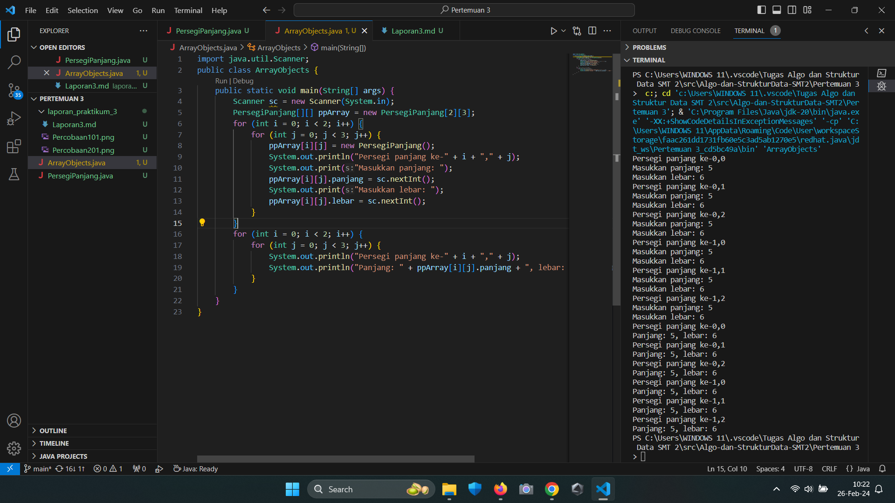

3. Jika diketahui terdapat class Persegi yang memiliki atribut sisi bertipe integer, maka kode
dibawah ini akan memunculkan error saat dijalankan. Mengapa?

Jawab: Karena melebihi batas array

4. Modifikasi kode program pada praktikum 3.3 agar length array menjadi inputan dengan Scanner!

Jawab:  
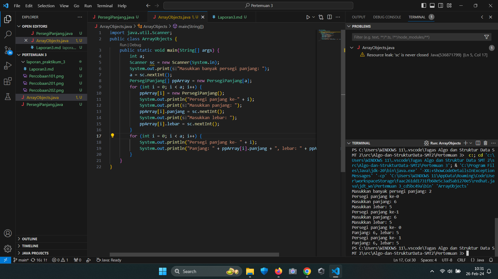

5. Apakah boleh Jika terjadi duplikasi instansiasi array of objek, misalkan saja instansiasi dilakukan
pada ppArray[i] sekaligus ppArray[0]?Jelaskan !

Jawab: Instansiasi array of objek tidak dapat dilakukan dengan duplikasi, yaitu dengan mencoba menginstansiasi dua elemen array sekaligus seperti ppArray[i] dan ppArray[0]. Harus menginstansiasi setiap elemen array secara terpisah.

### 2.3 Percobaan 3: Penambahan Operasi Matematika di Dalam Method

#### Verifikasi Hasil Percobaan:
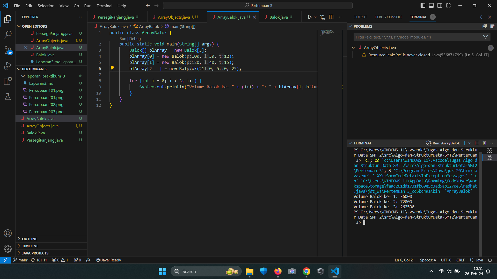

#### Pertanyaan
1. Dapatkah konstruktor berjumlah lebih dalam satu kelas? Jelaskan dengan contoh!

Jawab: Ya, sebuah kelas dapat memiliki lebih dari satu konstruktor. Konstruktor adalah metode khusus yang dipanggil saat objek kelas dibuat. Dengan adanya beberapa konstruktor, kita dapat membuat objek dengan cara yang berbeda berdasarkan kebutuhan atau argumen yang diberikan.
Contoh:
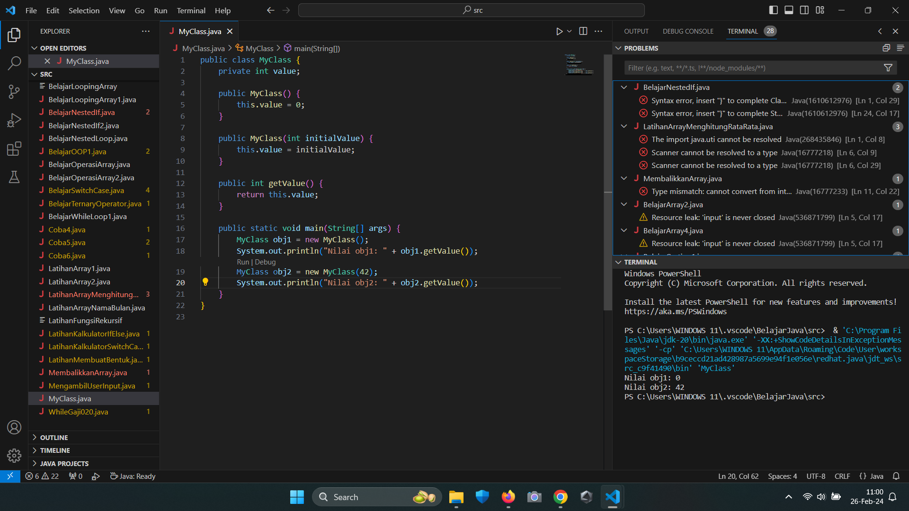

2. Jika diketahui terdapat class Segitiga seperti berikut ini:
Tambahkan konstruktor pada class Segitiga tersebut yang berisi parameter int a, int t
yang masing-masing digunakan untuk mengisikan atribut alas dan tinggi.

3. Tambahkan method hitungLuas() dan hitungKeliling() pada class Segitiga
tersebut. Asumsi segitiga adalah segitiga siku-siku. (Hint: Anda dapat menggunakan bantuan
library Math pada Java untuk mengkalkulasi sisi miring)

4. Pada fungsi main, buat array Segitiga sgArray yang berisi 4 elemen, isikan masing-masing
atributnya sebagai berikut:
sgArray ke-0 alas: 10, tinggi: 4
sgArray ke-1 alas: 20, tinggi: 10
sgArray ke-2 alas: 15, tinggi: 6
sgArray ke-3 alas: 25, tinggi: 10

5. Kemudian menggunakan looping, cetak luas dan keliling dengan cara memanggil method
hitungLuas() dan hitungKeliling().

Jawab:
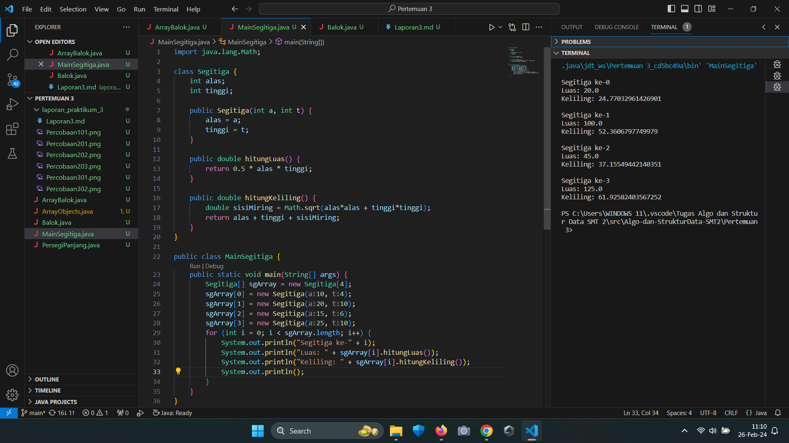

## 3. Latihan Praktikum
1. Buatlah program yang dapat menghitung luas permukaan dan volume bangun ruang kerucut,
limas segi empat sama sisi, dan bola. Buatlah 3 (tiga) class sesuai dengan jumlah jenis bangun
ruang. Buatlah satu main class untuk membuat array of objects yang menginputkan atribut-
atribut yang ada menggunakan konstruktor semua bangun ruang tersebut. Dengan ketentuan,

a. Buat looping untuk menginputkan masing-masing atributnya, kemudian tampilkan
luas permukaan dan volume dari tiap jenis bangun ruang tersebut.

b. Pada kerucut, inputan untuk atribut hanya jari-jari dan sisi miring

c. Pada limas segi empat sama sisi, inputan untuk atribut hanya panjang sisi alas dan
tinggi limas

d. Pada bola, inpuntan untuk atribut hanya jari-jari

Jawab:
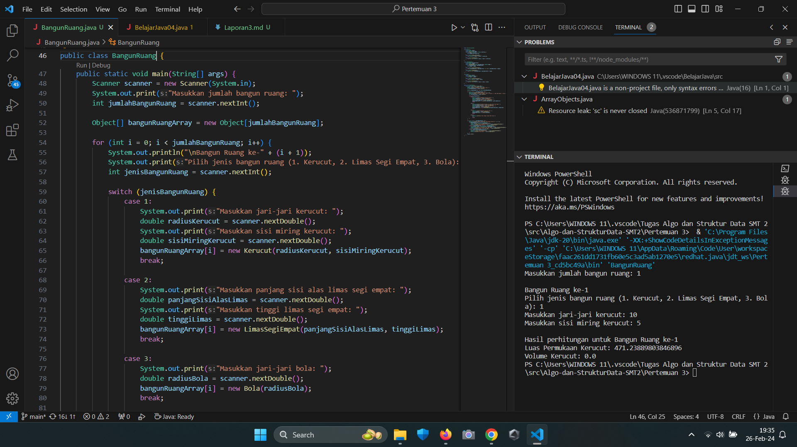
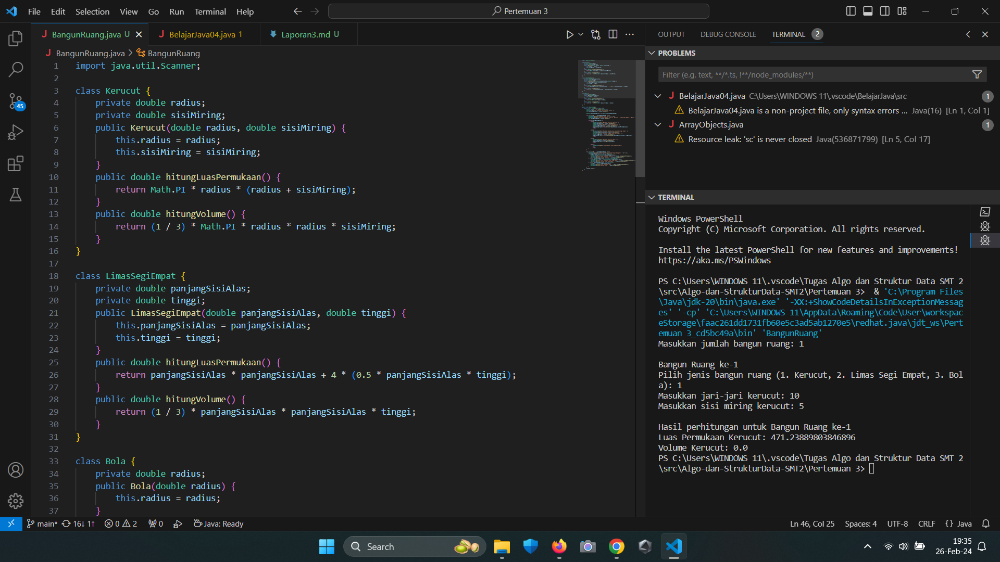

2. Sebuah kampus membutuhkan program untuk menampilkan informasi mahasiswa berupa nama,
nim, jenis kelamin dan juga IPK mahasiswa. Program dapat menerima input semua informasi
tersebut, kemudian menampilkanya kembali ke user. Implementasikan program tersebut jika
dimisalkan terdapat 3 data mahasiswa yang tersedia. Contoh output program:
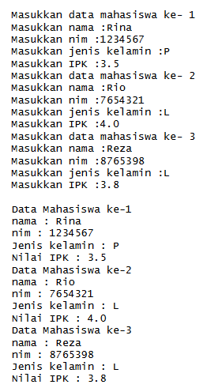

Jawab:
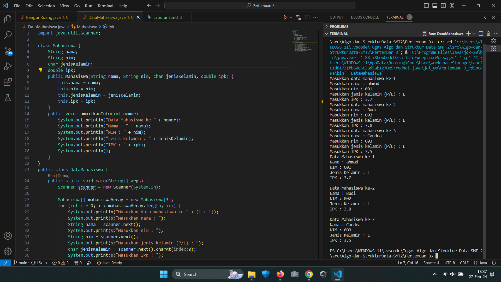

3. Modifikasi program Latihan no.2 di atas, sehingga bisa digunakan untuk menghitung rata-rata IPK,
serta menampilkan data mahasiswa dengan IPK terbesar! (gunakan method untuk masing-masing
proses tersebut)

Jawab:
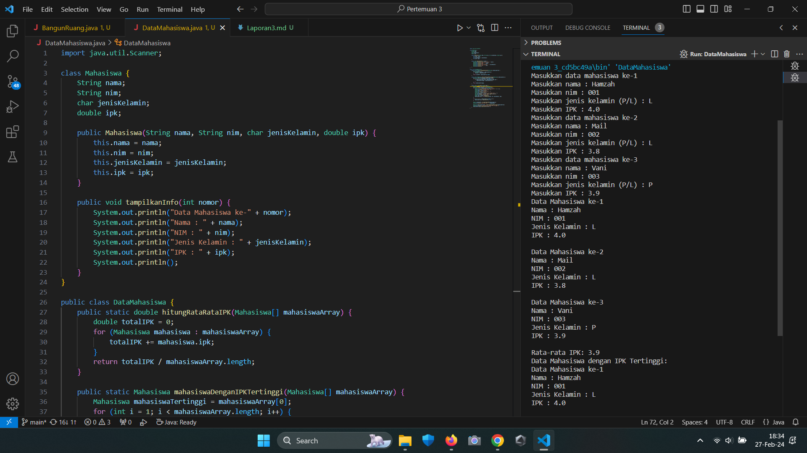

