# Laporan Praktikum Jobsheet 4
Nama: Achmad Maulana Hamzah

Prodi: D-IV Teknik Informatika, Kelas: 1-H; No.Absen: 02

## 1.1 Tujuan Praktikum
Setelah melakukan materi praktikum ini, mahasiswa mampu:
1. Mahasiswa mampu membuat algoritma bruteforce dan divide-conquer
2. Mahasiswa mampu menerapkan penggunaan algorima bruteforce dan divide-conquer

## 1.2 Menghitung Nilai Faktorial dengan Algoritma Brute Force dan Divide and Conquer

### 1.2.1 Verifikasi Hasil Percobaan
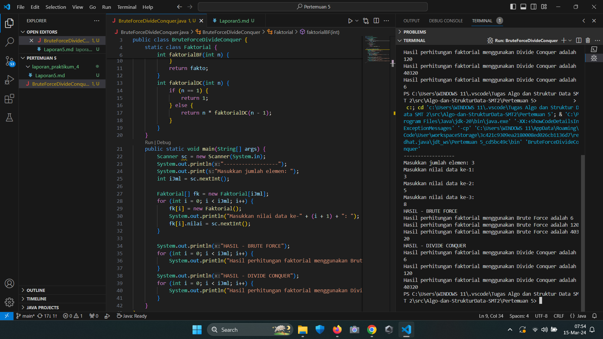

### 1.2.2 Pertanyaan
1. Pada base line Algoritma Divide Conquer untuk melakukan pencarian nilai faktorial, jelaskan
perbedaan bagian kode pada penggunaan if dan else!

Jawaban:

if digunakan untuk menentukan kapan rekursif harus berhenti. Hal ini mencegah rekursi yang tak terbatas dan merupakan kondisi yang harus dipenuhi untuk mengembalikan nilai tanpa melakukan panggilan rekursif lebih lanjut.

else digunakan untuk menentukan aksi yang diambil untuk memecah masalah menjadi lebih kecil, melalui panggilan fungsi rekursif, hingga kondisi dasar terpenuhi.

2. Apakah memungkinkan perulangan pada method faktorialBF() dirubah selain menggunakan
for?Buktikan!

Jawaban: method faktorialBF() dapat dirubah selain for, seperti contohnya menggunakan perulangan while.

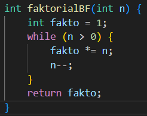

3. Jelaskan perbedaan antara fakto *= i; dan int fakto = n * faktorialDC(n-1); !

Jawaban:

fakto *=1 menggunakan iterasi secara bertahap untuk menghitung faktorial dengan mengalikan bilangan secara berurutan. 

int fakto = n * faktorialDC(n-1); menggunakan rekursi, di mana fungsi memanggil dirinya sendiri untuk menghitung faktorial.

## 1.3 Menghitung Hasil Pangkat dengan Algoritma Brute Force dan Divide and Conque

### 1.3.1 Verifikasi Hasil Percobaan
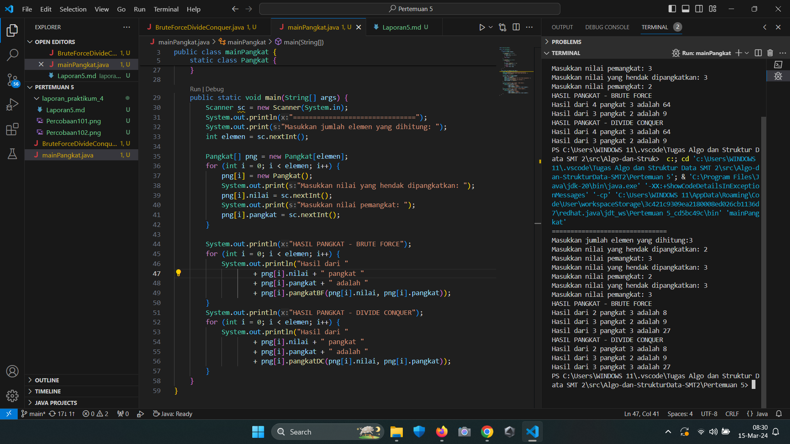

### 1.3.2 Pertanyaan

1. Jelaskan mengenai perbedaan 2 method yang dibuat yaitu PangkatBF() dan PangkatDC() !

Jawaban: 

method PangkatBF() dibuat dibuat dengan mengalikan basis (a) sebanyak n kali secara berurutan.

method PangkatDC() dibuat dengan membagi eksponen (n) menjadi dua bagian sekitar setengahnya. Jika eksponen ganjil, maka hasilnya akan dikalikan dengan basis (a) yang belum dipangkatkan, jika genap, hasilnya akan dikalikan dengan hasil yang sudah ada.

2. Apakah tahap combine sudah termasuk dalam kode tersebut?Tunjukkan!

Jawaban: Tahap combine sudah terdapat pada method PangkatDC()

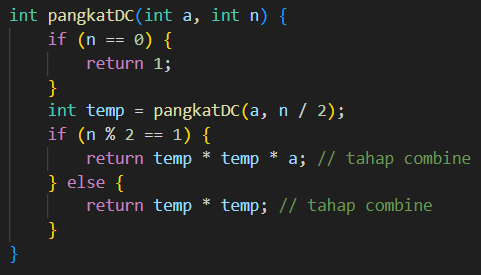

3. Modifikasi kode program tersebut, anggap proses pengisian atribut dilakukan dengan
konstruktor.

Jawaban:

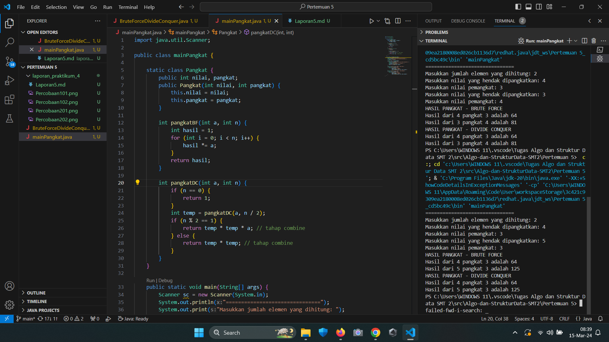

4. Tambahkan menu agar salah satu method yang terpilih saja yang akan dijalankan menggunakan
switch-case!

Jawaban:

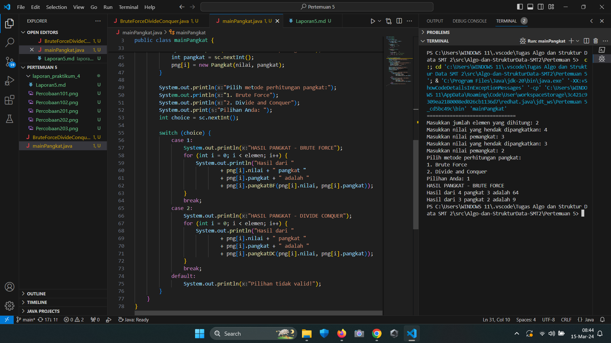

## 1.4 Menghitung Sum Array dengan Algoritma Brute Force dan Divide and Conquer

### 1.4.1 Verifikasi Hasil Percobaan

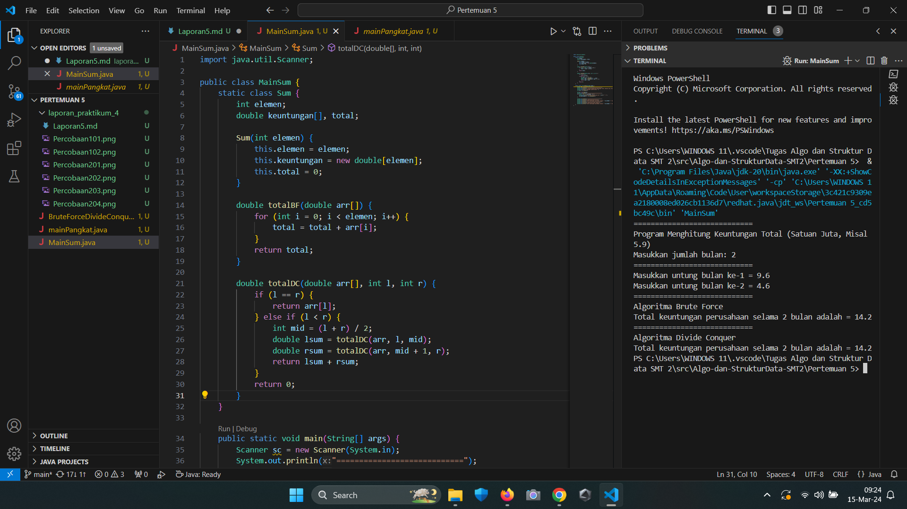

### 1.4.2 Pertanyaan
1. Mengapa terdapat formulasi return value berikut?Jelaskan!

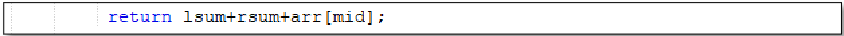

Jawaban: Formulasi return value tersebut salah sehingga harus diubah dengan menghilangkan arr[mid].

Formulasi return value digunakan karena ketika array dibagi menjadi dua bagian, kita menghitung jumlah keuntungan dari kedua bagian tersebut secara terpisah (rekursif) dan kemudian menggabungkan hasilnya.

2. Kenapa dibutuhkan variable mid pada method TotalDC() ?

Jawaban: Variabel mid diperlukan dalam metode totalDC() untuk menentukan bagaimana array akan dibagi menjadi subarray saat menggunakan methode Divide and Conquer.

3. Program perhitungan keuntungan suatu perusahaan ini hanya untuk satu perusahaan saja.
Bagaimana cara menghitung sekaligus keuntungan beberapa bulan untuk beberapa
perusahaan.(Setiap perusahaan bisa saja memiliki jumlah bulan berbeda-beda)? Buktikan
dengan program!

Jawaban:

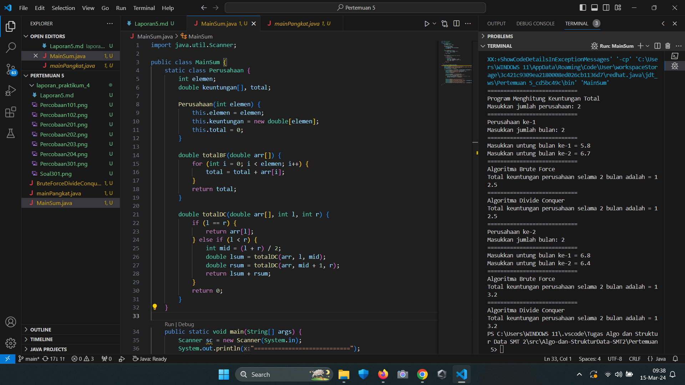

## 1.5 Latihan Praktikum
1. Sebuah showroom memiliki daftar mobil dengan data sesuai tabel di bawah ini

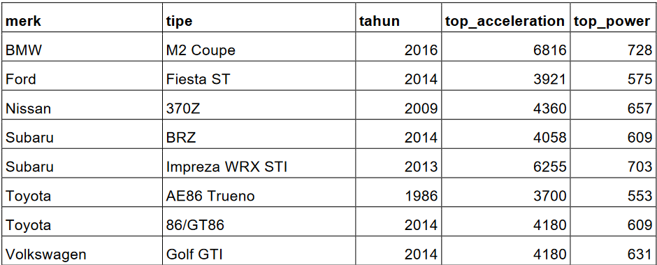

Tentukan:

a) top_acceleration tertinggi menggunakan Divide and Conquer!

b) top_acceleration terendah menggunakan Divide and Conquer!

c) Rata-rata top_power dari seluruh mobil menggunakan Brute Force!

Jawaban:

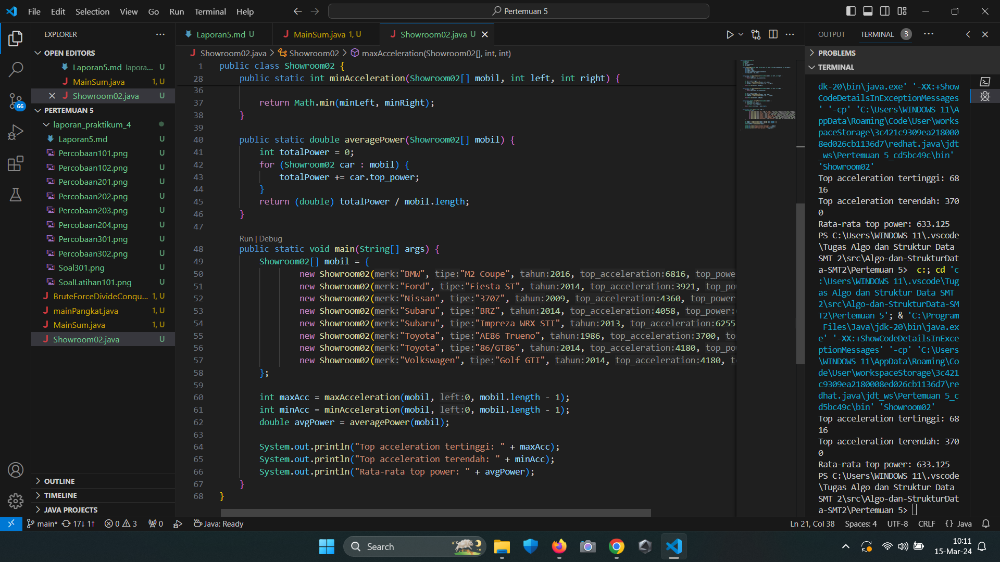

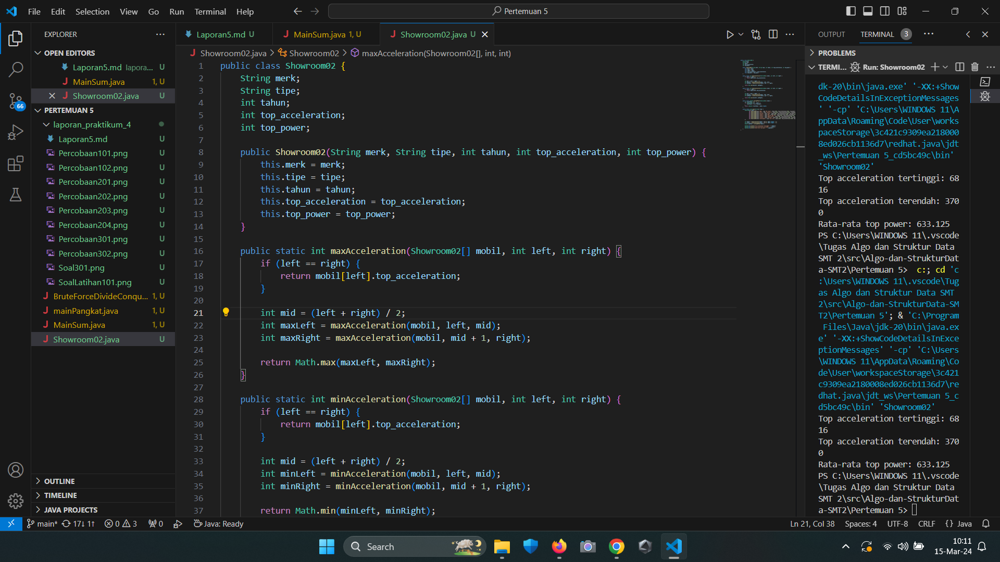