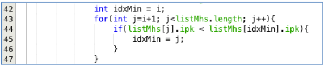
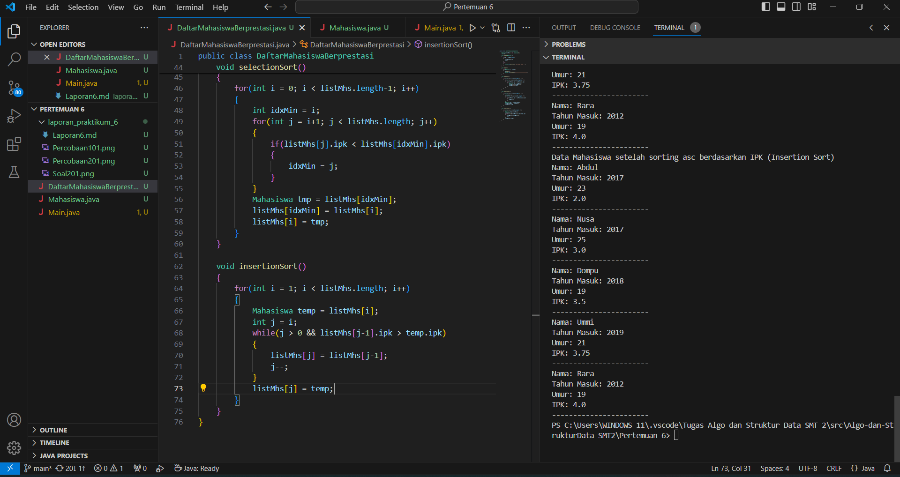
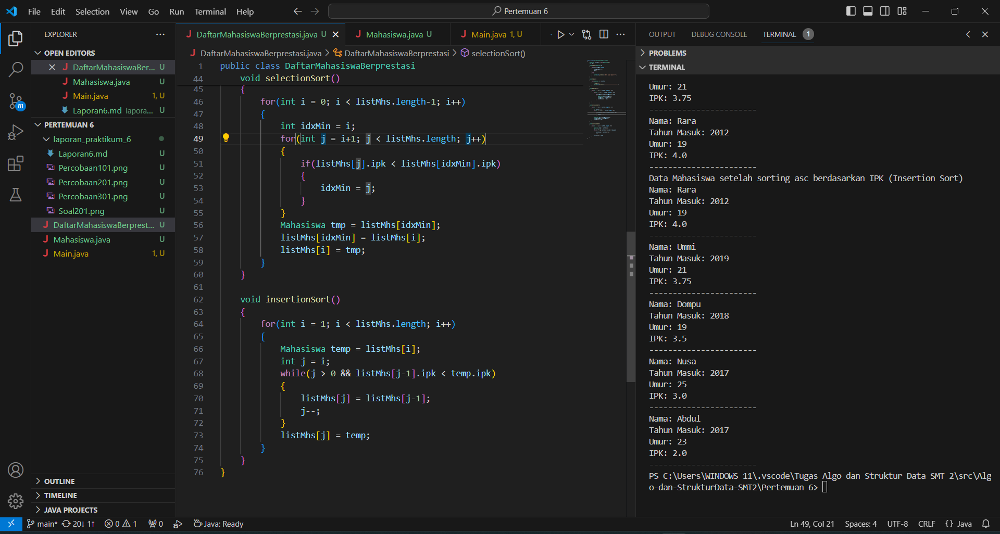
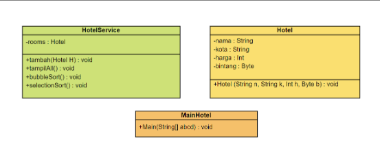
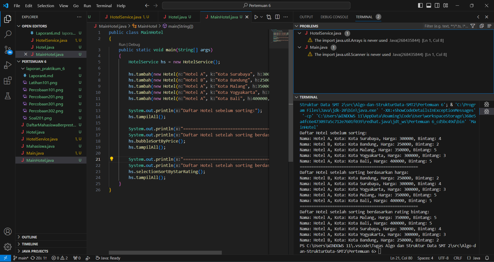
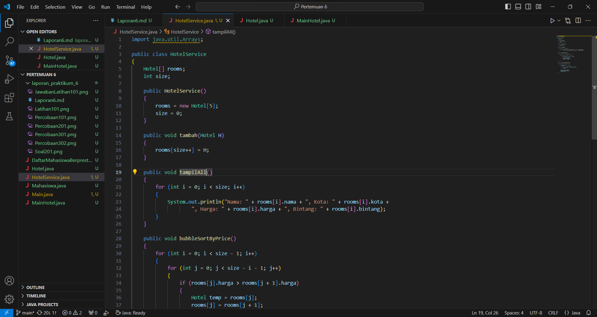
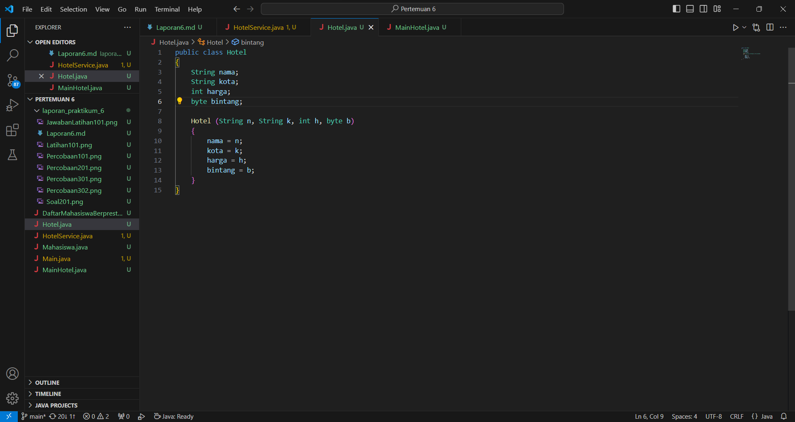

# Laporan Praktikum - Jobsheet 5
Nama: Achmad Maulana Hamzah

Kelas / Absen: TI 1H / 02

NIM: 2341720172

## 1.1 Tujuan Praktikum
Setelah melakukan praktikum ini diharapkan mahasiswa mampu:

a. Mahasiswa mampu membuat algoritma searching bubble sort, selection sort dan
insertion sort

b. Mahasiswa mampu menerapkan algoritma searching bubble sort, selection sort
dan insertion sort pada program

## 1.2 Mengurutkan Data Mahasiswa Berdasarkan IPK Menggunakan Bubble Sort

### 1.2.1 Verifikasi Hasil Percobaan

### 1.2.2 Pertanyaan
1. Terdapat di method apakah proses bubble sort?

Jawaban: Terdapat pada class DaftarMahasiswaBerprestasi pada method bubbleSort()

2. Di dalam method bubbleSort(), terdapat baris program seperti di bawah ini:
Untuk apakah proses tersebut?

Jawaban: Proses ini adalah langkah dalam algoritma bubble sort yang bertujuan untuk memastikan bahwa objek dengan nilai IPK yang lebih tinggi bergerak ke arah akhir array secara berurutan hingga array diurutkan dari nilai IPK terbesar ke terkecil.

3. Perhatikan perulangan di dalam bubbleSort() di bawah ini:

a. Apakah perbedaan antara kegunaan perulangan i dan perulangan j?

Jawaban: 

Variabel i digunakan untuk menunjukkan iterasi yang sedang dilakukan, dimulai dari 0 hingga listMhs.length - 2. Tujuan dari perulangan i adalah untuk mengatur batasan jumlah iterasi yang diperlukan untuk menyortir elemen-elemen dalam array.

Variabel j digunakan untuk melakukan perbandingan dan penukaran antara dua elemen yang berdekatan dalam array. Variabel j juga digunakan untuk menunjukkan posisi elemen saat ini dalam array.

b. Mengapa syarat dari perulangan i adalah i<listMhs.length-1 ?

Jawaban: Untuk memastikan bahwa algoritma hanya melakukan iterasi sebanyak yang diperlukan untuk menyusun elemen-elemen dalam urutan yang benar.

c. Mengapa syarat dari perulangan j adalah j<listMhs.length-i ?

Jawaban: Untuk memastikan bahwa hanya elemen-elemen sebelum elemen terakhir yang diperiksa dalam setiap iterasi perulangan j, sesuai dengan konsep dasar dari algoritma bubble sort yang bergerak dari ujung array (yang belum terurut) menuju ke ujung yang sudah terurut.

d. Jika banyak data di dalam listMhs adalah 50, maka berapakali perulangan i akan berlangsung? Dan ada berapa Tahap bubble sort yang ditempuh?

Jawaban: Jika ada 50 data di dalam listMhs, maka perulangan i akan berlangsung sebanyak 49 kali. Karena perulangan i dimulai dari 0 hingga listMhs.length - 1, dan jika terdapat 50 data, panjang array adalah 50, sehingga 49 iterasi diperlukan.

## 1.3 Mengurutkan Data Mahasiswa Berdasarkan IPK Menggunakan Selection Sort

### 1.3.1 Verifikasi Hasil Percobaan

### 1.3.2 Pertanyaan

Di dalam method selection sort, terdapat baris program seperti di bawah ini:

Untuk apakah proses tersebut, jelaskan!

Jawaban: pada kode program ini akan dilakukan pencarian indeks dari elemen terkecil dalam array yang belum diurutkan. Kemudian kita akan mendapatkan indeks dari elemen terkecil dalam area yang belum diurutkan. Langkah selanjutnya dalam algoritma Selection Sort adalah menukar elemen terkecil tersebut dengan elemen pertama dalam area yang belum diurutkan (yaitu, elemen dengan indeks i).

## 1.4 Mengurutkan Data Mahasiswa Berdasarkan IPK Menggunakan Insertion Sort

### 1.4.1 Verifikasi Hasil Percobaan

### 1.4.2 Pertanyaan
Ubahlah fungsi pada InsertionSort sehingga fungsi ini dapat melaksanakan proses sorting
dengan cara descending.

Jawaban:

hanya dengan mengubah tanda lebih dari (>) menjadi kurang dari (<) pada perulangan while-nya

## 1.5 Latihan Praktikum

Sebuah platform travel yang menyediakan layanan pemesanan kebutuhan travelling sedang
mengembangkan backend untuk sistem pemesanan/reservasi akomodasi (penginapan), salah
satu fiturnya adalah menampilkan daftar penginapan yang tersedia berdasarkan pilihan filter
yang diinginkan user. Daftar penginapan ini harus dapat disorting berdasarkan
1. Harga dimulai dari harga termurah ke harga tertinggi.
2. Rating bintang penginapan dari bintang tertinggi (5) ke terendah (1)
Buatlah proses sorting data untuk kedua filter tersebut dengan menggunakan algoritma
bubble sort dan selection sort

Jawaban: 

