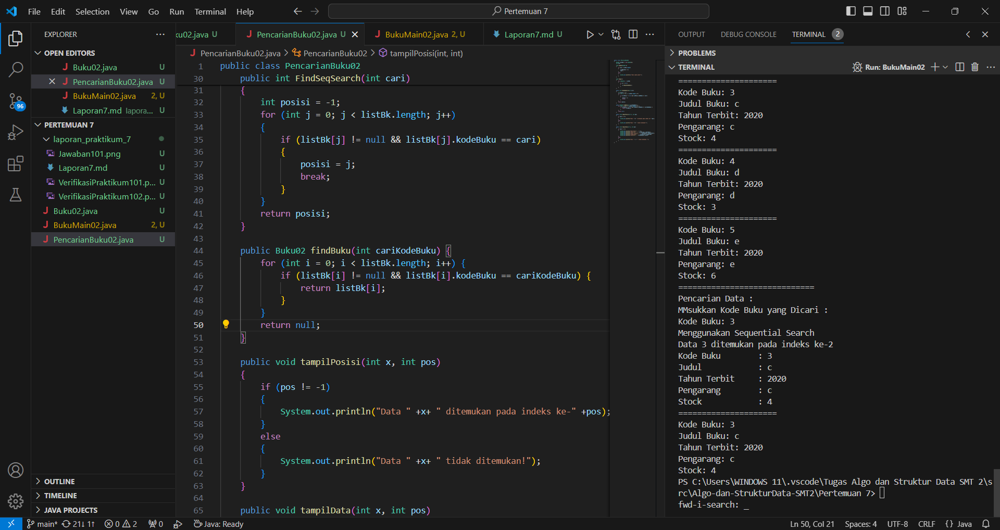

# Jobsheet 6 (Searching)
Nama: Achmad Maulana Hamzah

Kelas / Absen: TI 1H / 02

NIM: 2341720172

## 1.1 Tujuan Praktikum
Setelah melakukan materi praktikum ini, mahasiswa mampu:
1. Menjelaskan mengenai algoritma Searching.
2. Membuat dan mendeklarasikan struktur algoritma Searching.
3. Menerapkan dan mengimplementasikan algoritma Searching.

## 1.2 Searching / Pencarian Menggunakan Agoritma Sequential Search

### 1.2.1 Verifikasi Hasil Praktikum

### 1.2.2 Pertanyaan
1. Jelaskan fungsi break yang ada pada method FindSeqSearch!

Jawaban: break digunakan untuk menghentikan iterasi dalam loop for begitu saja ketika buku dengan kode yang dicari ditemukan.

2. Jika Data Kode Buku yang dimasukkan tidak terurut dari kecil ke besar. Apakah program masih
dapat berjalan? Apakah hasil yang dikeluarkan benar? Tunjukkan hasil screenshoot untuk bukti
dengan kode Buku yang acak. Jelaskan Mengapa hal tersebut bisa terjadi?

Jawaban:

Jika data kode buku yang dimasukkan tidak terurut dari kecil ke besar, program masih akan berjalan tetapi output yang dikeluarkan tidak benar. 

Pencarian berurutan mengasumsikan bahwa data diurutkan, sehingga jika data tidak terurut, algoritma pencarian tidak dapat bekerja secara efisien. Dalam hal ini, meskipun program berjalan, hasil pencarian mungkin tidak akurat karena algoritma hanya akan berhenti saat menemukan elemen yang dicari pertama kali, tanpa memperhatikan urutan elemen-elemen tersebut.

3. Buat method baru dengan nama FindBuku menggunakan konsep sequential search dengan tipe
method dari FindBuku adalah BukuNoAbsen. Sehingga Anda bisa memanggil method
tersebut pada class BukuMain seperti gambar berikut :

Jawaban: 

## 1.3 Searching / Pencarian Menggunakan Binary Search

### 1.3.1 Verifikasi Hasil Praktikum

### 1.3.2 Pertanyaan
1. Tunjukkan pada kode program yang mana proses divide dijalankan!

Jawaban:

2. Tunjukkan pada kode program yang mana proses conquer dijalankan!

Jawaban:

3. Jika data Kode Buku yang dimasukkan tidak urut. Apakah program masih dapat berjalan? Mengapa
demikian! Tunjukkan hasil screenshoot untuk bukti dengan kode Buku yang acak. Jelaskan
Mengapa hal tersebut bisa terjadi?

Jawaban:

Jika data kode buku yang dimasukkan tidak terurut dari kecil ke besar, program masih akan berjalan tetapi output yang dikeluarkan tidak benar. 

Pencarian berurutan mengasumsikan bahwa data diurutkan, sehingga jika data tidak terurut, algoritma pencarian tidak dapat bekerja secara efisien. Dalam hal ini, meskipun program berjalan, hasil pencarian mungkin tidak akurat karena algoritma hanya akan berhenti saat menemukan elemen yang dicari pertama kali, tanpa memperhatikan urutan elemen-elemen tersebut.

4. Jika Kode Buku yang dimasukkan dari Kode Buku terbesar ke terkecil (missal : 20215, 20214,
20212, 20211, 20210) dan elemen yang dicari adalah 20210. Bagaimana hasil dari binary search?
Apakah sesuai? Jika tidak sesuai maka ubahlah kode program binary seach agar hasilnya sesuai!

Jawaban: Hasilnya tidak ditemukan

Hasil Perubahan Kode Program

## 1.4 Percobaan Pengayaan Divide and Conquer

### 1.4.1 Verifikasi Hasil Praktikum

## 1.5 Latihan Praktikum

1. Modifikasi percobaan searching diatas dengan ketentuan berikut ini
- Ubah tipe data dari kode Buku yang awalnya int menjadi String
- Tambahkan method untuk pencarian kode Buku (bertipe data String) dengan menggunakan
sequential search dan binary search.

Jawaban: 

2. Modifikasi percobaan searching diatas dengan ketentuan berikut ini
- Tambahkan method pencarian judul buku menggunakan sequential search dan binary
search. Sebelum dilakukan searching dengan binary search data harus dilakukan pengurutan
dengan menggunakan algoritma Sorting (bebas pilih algoritma sorting apapun)! Sehingga
ketika input data acak, maka algoritma searching akan tetap berjalan

Jawaban:

- Buat aturan untuk mendeteksi hasil pencarian judul buku yang lebih dari 1 hasil dalam
bentuk kalimat peringatan! Pastikan algoritma yang diterapkan sesuai dengan kasus yang
diberikan!

Jawaban: 
