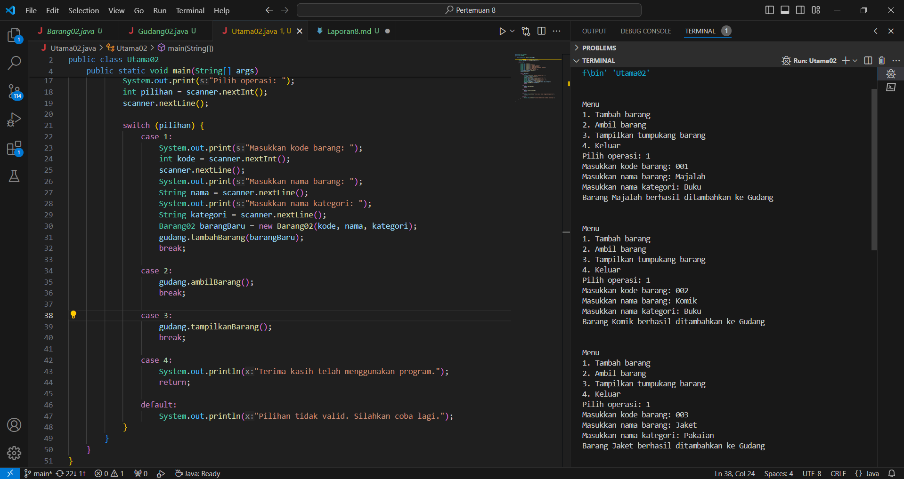
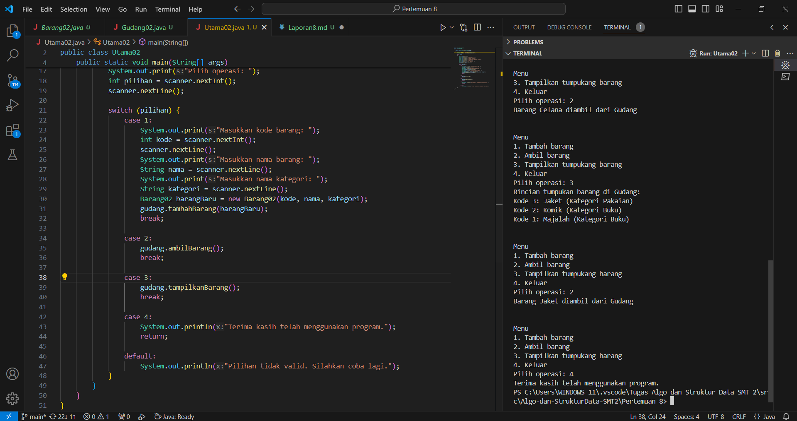
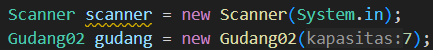
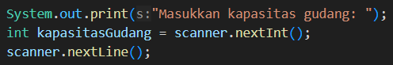
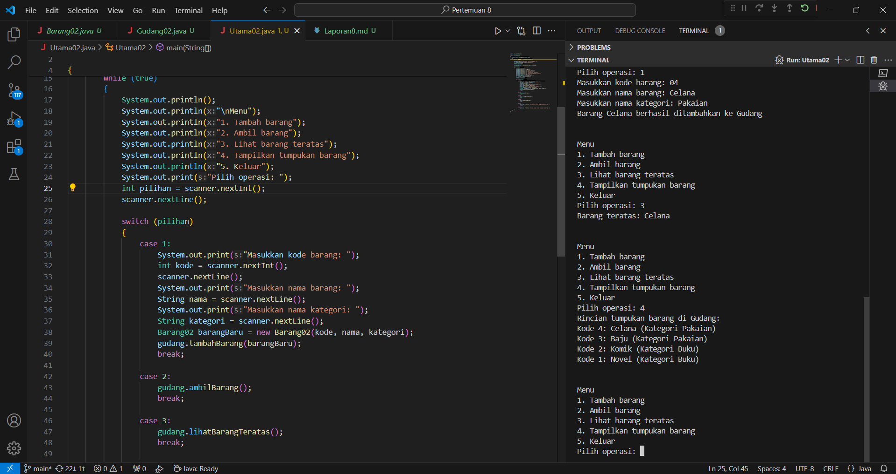
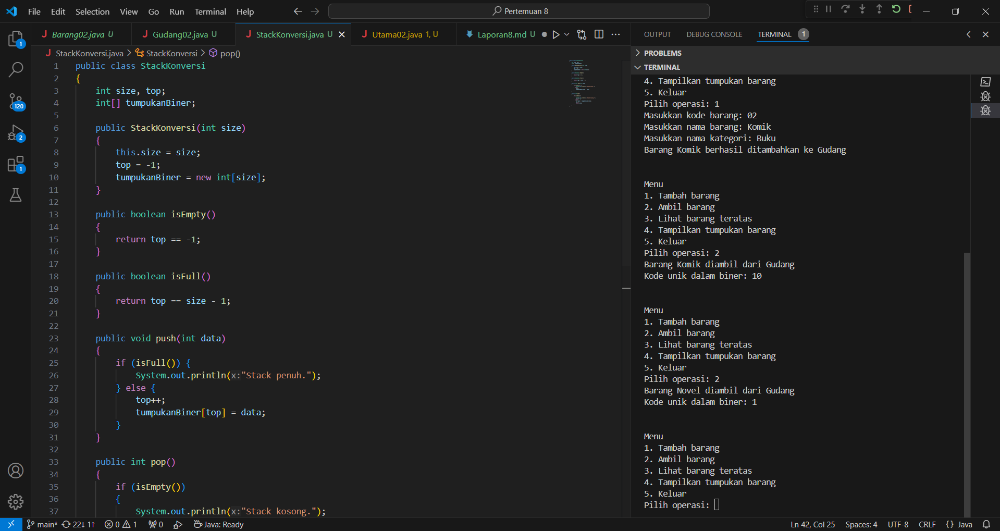
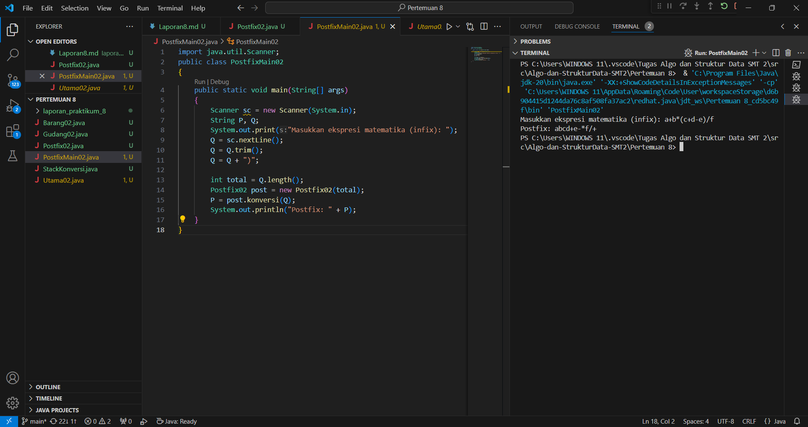
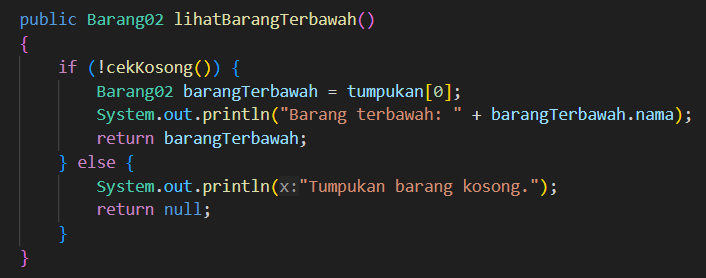
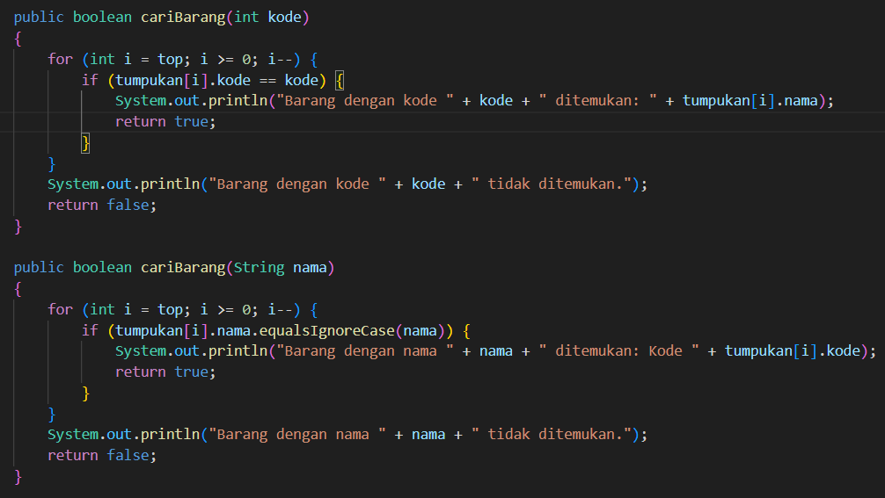

# Jobsheet 7 (Stack)
Nama: Achmad Maulana Hamzah

Kelas / Absen: TI 1H / 02

NIM: 2341720172

## 1.1 Tujuan Praktikum
Setelah melakukan materi praktikum ini, mahasiswa mampu:
1. Membuat struktur data Stack
2. Menerapkan algoritma Stack ke dalam program

## 1.2 Percobaan 1: Penyimpanan Tumpukan Barang dalam Gudang

### 1.2.1 Verifikasi Hasil Praktikum

### 1.2.2 Pertanyaan
1. Lakukan perbaikan pada kode program, sehingga keluaran yang dihasilkan sama dengan verifikasi hasil percobaan! Bagian mana saja yang perlu diperbaiki?

Jawaban: 

Pada class Gudang02 method tampilkanBarang, "for (int j = 0; j <= top; j++)" tidak diperlukan sehingga hanya ada 1 perulangan saja menggunakan "for (int i = top; i >= 0; i--)".
Kemudian pada class Gudang02 method cekKosong dan cekPenuh sebenarnya tidak perlu menggunakan pengandaian, cukup menggunakan 

    public boolean cekKosong() 
    {
        return top == -1;
    }

dan

    public boolean cekPenuh() 
    {
        return top == size - 1;
    }

untuk meminimalisir panjang kode program

2. Berapa banyak data barang yang dapat ditampung di dalam tumpukan? Tunjukkan potongan kode
programnya!

Jawaban: 

Data barang hanya muat menampung 7 barang saja, sesuai dengan objek yang telah dibuat

3. Mengapa perlu pengecekan kondisi !cekKosong() pada method tampilkanBarang? Kalau kondisi
tersebut dihapus, apa dampaknya?

Jawaban: 

Pengecekan kondisi !cekKosong() pada metode tampilkanBarang() digunakan untuk memastikan bahwa tumpukan barang tidak kosong sebelum mencoba untuk menampilkan barang. Hal ini dilakukan untuk menghindari potensi kesalahan atau kegagalan dalam mencoba menampilkan barang dari tumpukan yang kosong.

4. Modifikasi kode program pada class Utama sehingga pengguna juga dapat memilih operasi lihat
barang teratas, serta dapat secara bebas menentukan kapasitas gudang!

Jawaban:

5. Commit dan push kode program ke Github

## 1.3 Percobaan 2: Konversi Kode Barang ke Biner

### 1.3.1 Verifikasi Hasil Praktikum

### 1.3.2 Pertanyaan

1. Pada method konversiDesimalKeBiner, ubah kondisi perulangan menjadi while (kode != 0),
bagaimana hasilnya? Jelaskan alasannya!

Jawaban:

mengubah kondisi perulangan pada metode konversiDesimalKeBiner menjadi while (kode != 0), maka hasilnya akan tetap sama. Ini karena tujuan dari metode konversiDesimalKeBiner adalah untuk mengkonversi nilai desimal menjadi representasi biner.

Alasan mengapa kondisi perulangan diubah menjadi while (kode != 0) adalah karena dalam representasi biner, kita terus membagi bilangan desimal dengan 2 sampai sisa bagi menjadi 0. Dengan demikian, perulangan akan berlangsung sampai nilai kode menjadi 0.

2. Jelaskan alur kerja dari method konversiDesimalKeBiner!

Jawaban:

1. Pertama, objek stack dari kelas StackKonversi dibuat menggunakan konstruktor. Objek ini akan digunakan untuk menyimpan sisa-sisa pembagian saat konversi desimal ke biner.

2. Selama nilai kode tidak sama dengan 0 (atau dalam versi yang dimodifikasi, selama nilai kode lebih besar dari 0), proses konversi akan berlanjut. Ini berarti kita akan terus membagi kode dengan 2 sampai nilainya menjadi 0.

3. Pada setiap iterasi perulangan, nilai kode akan dibagi dengan 2 untuk mendapatkan sisa pembagian dan hasil bagi. Sisa pembagian ini akan menentukan digit biner yang akan disimpan di dalam stack. Sisa pembagian tersebut akan ditambahkan ke stack menggunakan metode push().

4. Setelah semua sisa pembagian telah dimasukkan ke dalam stack, kita akan mengeluarkan digit-digit biner dari stack satu per satu. Karena digit-digit tersebut dimasukkan ke dalam stack secara terbalik, kita perlu membalikkan urutan digit untuk mendapatkan representasi biner yang benar.

5. Digit-digit biner yang telah dibalikkan akan digabungkan menjadi sebuah string biner yang lengkap. Setiap digit biner akan digabungkan dengan operator penambahan (+=) untuk membentuk string biner akhir.

6. String biner yang dihasilkan akan dikembalikan sebagai hasil dari metode konversiDesimalKeBiner.

## 1.4 Percobaan 3: Konversi Notasi Infix ke Postfix

### 1.4.1 Verifikasi Hasil Praktikum

### 1.4.2 Pertanyaan

1. Pada method derajat, mengapa return value beberapa case bernilai sama? Apabila return
value diubah dengan nilai berbeda-beda setiap case-nya, apa yang terjadi?

Jawaban:

Pada method derajat, beberapa case mengembalikan nilai yang sama karena operator tertentu memiliki prioritas yang sama dalam urutan operasi matematika. Misalnya, dalam ekspresi infix, operator perkalian (*) dan pembagian (/) memiliki prioritas yang sama, begitu pula dengan operator penjumlahan (+) dan pengurangan (-).

Namun, jika mengubah return value sehingga setiap case mengembalikan nilai yang berbeda, maka urutan operasi matematika akan diubah. Hal ini dapat mempengaruhi hasil konversi ekspresi infix menjadi postfix. Operasi akan dievaluasi sesuai dengan prioritas yang ditetapkan oleh nilai yang dikembalikan oleh method derajat.

2. Jelaskan alur kerja method konversi!

Jawaban:

- Variabel P digunakan untuk menyimpan ekspresi postfix yang dihasilkan. Variabel c digunakan untuk menyimpan karakter saat ini yang sedang diproses.

- Metode melakukan iterasi melalui setiap karakter dalam ekspresi infix yang diberikan, dimulai dari karakter pertama hingga karakter terakhir.

- Jika karakter saat ini adalah operand (misalnya huruf atau angka), karakter tersebut langsung ditambahkan ke dalam ekspresi postfix P.

- Jika karakter saat ini adalah kurung buka '(', kurung buka tersebut dimasukkan ke dalam stack.

- Jika karakter saat ini adalah kurung tutup ')', metode akan mengeluarkan operator dari stack dan menambahkannya ke dalam ekspresi postfix P sampai menemukan kurung buka yang sesuai. Kurung buka tersebut juga dihapus dari stack.

- Jika karakter saat ini adalah operator, metode akan memeriksa derajat prioritas operator saat ini dengan operator teratas di stack. Jika derajat prioritas operator saat ini lebih rendah atau sama dengan derajat prioritas operator teratas di stack, maka operator teratas di stack akan dikeluarkan dan ditambahkan ke dalam ekspresi postfix P. Hal ini dilakukan hingga tidak ada operator di stack yang memiliki prioritas lebih tinggi dari operator saat ini atau stack menjadi kosong. Setelah itu, operator saat ini ditambahkan ke dalam stack.

- Iterasi melalui ekspresi infix selesai. Namun, mungkin masih ada operator yang tersisa di stack. Operator-operator tersebut dikeluarkan dan ditambahkan ke dalam ekspresi postfix P sampai stack kosong.

- Ekspresi postfix yang dihasilkan disimpan dalam variabel P dan dikembalikan sebagai hasil dari metode konversi.

3. Pada method konversi, apa fungsi dari potongan kode berikut?

Jawaban:

Potongan kode c = Q.charAt(i); bertujuan untuk mengambil karakter pada posisi indeks tertentu dari string Q. Ini digunakan dalam metode konversi untuk memproses setiap karakter dalam ekspresi infix secara berurutan.

## 1.5 Latihan Praktikum

Perhatikan dan gunakan kembali kode program pada Percobaan 1. Tambahkan dua method berikut
pada class Gudang:

• Method lihatBarangTerbawah digunakan untuk mengecek barang pada tumpukan terbawah

Jawaban:

• Method cariBarang digunakan untuk mencari ada atau tidaknya barang berdasarkan kode
barangnya atau nama barangnya

Jawaban:

